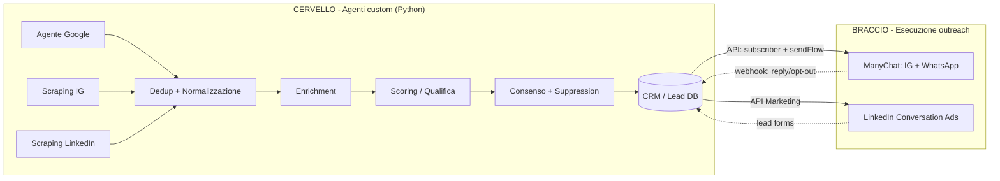
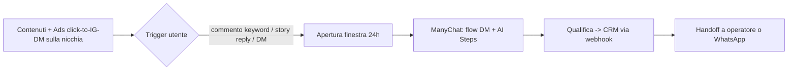
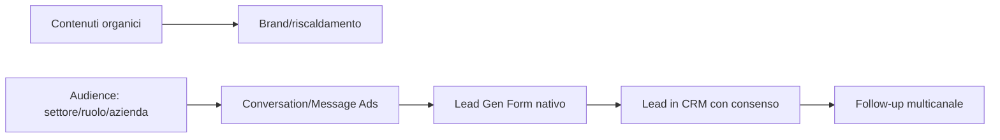
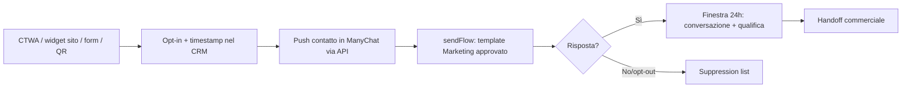
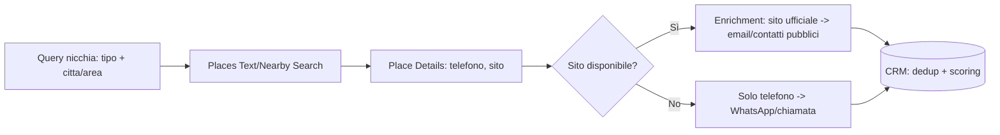
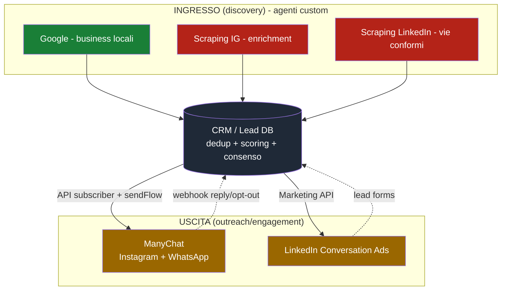

# Agenti Social per Lead Generation & Outreach — Struttura, Fattibilità e Programma Operativo

> **Documento strategico e tecnico** — Cliente esterno (progetto **stand-alone**, NON collegato alla `agents-platform`).
> Obiettivo: costruire 6 agenti (Instagram, Scraping Instagram, LinkedIn, Scraping LinkedIn, WhatsApp, Google Scraping) per **reach-out + engagement verso lead freddi** e **ricerca/catalogazione lead** in una **nicchia di riferimento**.
> Base di analisi: **API ufficiali** di ogni piattaforma + **ManyChat** come layer di esecuzione. Stato aggiornato a **luglio 2026**.

---

## 0. Come leggere questo documento (legenda semaforo)

| Simbolo | Significato |
|:---:|---|
| 🟢 | **Conforme** — fattibile via API ufficiale, senza violare i Termini |
| 🟡 | **Conforme con vincoli forti** — richiede opt-in, budget pubblicitario, App Review o verifiche |
| 🔴 | **NON consentito dall'API ufficiale** — realizzabile solo con strumenti non ufficiali (rischio ban + legale) |

> ⚠️ **Verità di fondo.** Le API ufficiali di **Instagram** e **LinkedIn** **non permettono** il cold outreach di massa (DM non richiesti), l'auto-follow/like verso terzi, né lo scraping di follower e profili. **WhatsApp** e **Google** offrono percorsi ufficiali solidi (rispettando opt-in e limiti di caching).
> **ManyChat non cambia queste regole** — è un partner ufficiale Meta che lavora *sopra* le API ufficiali: non abilita cold DM né scraping, ma è il modo **più rapido e conforme** per **eseguire** la parte conversazionale (engagement, sequenze DM, broadcast su opt-in) di Instagram e WhatsApp.

---

## 1. Executive Summary — la fattibilità in una tabella

| Agente | Obiettivo | API / strumento ufficiale | Fattibilità | Percorso consigliato |
|---|---|---|:---:|---|
| **Instagram (outreach)** | Cold DM + engagement | Instagram Graph API **+ ManyChat** | 🔴 Cold DM vietato | Ads click-to-DM + trigger commento/story (finestra 24h) eseguiti in ManyChat |
| **Scraping Instagram** | Trovare lead in nicchia | Business Discovery + Hashtag Search | 🔴 No liste follower/PII | Discovery su username noti + provider dati + lead ads |
| **LinkedIn (outreach)** | Cold DM + engagement | Marketing API (Conversation Ads) | 🟡 Solo a pagamento | Conversation/Message Ads + contenuti organici + Lead Gen Forms |
| **Scraping LinkedIn** | Trovare lead in nicchia | *(nessuna API di ricerca persone)* | 🔴 Scraping vietato | Lead Gen Forms + Sales Navigator (manuale) + data provider |
| **WhatsApp (messaggistica)** | Campagne + engagement | WhatsApp Cloud API **+ ManyChat/BSP** | 🟡 Solo con opt-in | Template Marketing + funnel opt-in (CTWA/widget/form) |
| **Google (scraping)** | Trovare lead in nicchia | Places API (New) + Custom Search | 🟢 Business B2B locali | Places Text/Nearby Search → enrichment sito → CRM |

**In sintesi:** la "macchina" più solida è **Google (discovery) → enrichment → CRM → outreach conforme**, dove l'**outreach su Instagram/WhatsApp è eseguito da ManyChat** e quello **B2B da LinkedIn Ads**. Il cliente conserva il "cervello" (scraping, scoring, consenso) negli **agenti custom**; ManyChat è il **layer di esecuzione**.

---

## 2. Architettura comune degli agenti

Modello **"cervello + braccio"**: gli **agenti custom** (Python) fanno discovery, enrichment, scoring e gestione consenso; **ManyChat** (per IG/WhatsApp) e le **API Ads** (per LinkedIn) sono il **braccio esecutivo**.



### 2.1 Fasi comuni
1. **Discovery / Scraping** — gli agenti "scraping" raccolgono candidati lead.
2. **Dedup & Normalizzazione** — chiave univoca (dominio, telefono E.164, handle), merge cross-canale.
3. **Enrichment** — sito, email, settore, dimensione, canali social.
4. **Scoring / Qualifica** — regole + LLM classifier → `hot / warm / cold / scarto`.
5. **Consenso & Suppression** — base giuridica (GDPR), opt-out/DNC, blacklist.
6. **Outreach / Engagement** — eseguito da ManyChat (IG/WhatsApp) e LinkedIn Ads, entro i limiti dell'API.
7. **Feedback loop** — risposte, opt-out, esiti ritornano nel CRM e aggiornano lo scoring.

### 2.2 Modello dati minimo (schema `leads`)

| Campo | Tipo | Note |
|---|---|---|
| `lead_id` | uuid | PK |
| `source` | enum | `google` / `ig_scrape` / `li_scrape` / `manual` / `ad_form` |
| `niche_tags` | text[] | classificazione nicchia |
| `company_name` / `website` | text | dati azienda |
| `email` | text | base giuridica obbligatoria (GDPR) |
| `phone_e164` | text | per WhatsApp |
| `ig_handle` / `li_url` | text | identificatori social |
| `manychat_subscriber_id` | text | **link al contatto ManyChat** |
| `score` | int | 0–100 |
| `status` | enum | `new / qualified / contacted / replied / opted_out / won / lost` |
| `consent_basis` | enum | `legittimo_interesse / consenso / n_a` |
| `consent_ts` | timestamptz | timestamp opt-in (WhatsApp/email) |
| `suppressed` | bool | opt-out / DNC |
| `last_touch_at` | timestamptz | per rispettare frequency cap |

### 2.3 Stack tecnico consigliato
- **Runtime agenti:** Python 3.12 (worker).
- **Orchestrazione/coda:** job queue (Redis/RQ o Celery) + scheduler per rate limit e finestre orarie.
- **Storage:** Postgres/Supabase per il CRM lead.
- **"Cervello":** LLM (Claude) per classificazione nicchia, personalizzazione copy, parsing pagine, gestione risposte.
- **Esecuzione outreach:** **ManyChat** (IG/WhatsApp) via API; **Meta Ads / LinkedIn Marketing API** per le campagne.
- **Segreti/token:** vault per token OAuth + **ManyChat API token**.
- **Osservabilità:** logging strutturato per ogni chiamata API (endpoint, quota, esito).

> **Build vs Buy.** Costruire da zero l'esecuzione IG/WhatsApp significa gestire in proprio le API Meta, le finestre 24h, i template, la moderazione: molto lavoro e rischio compliance. **ManyChat** copre questa parte "chiavi in mano" restando conforme → **consigliato** come braccio esecutivo, con gli agenti custom a orchestrarlo via API.

---

## 3. 🟠 Agente Instagram — Outreach & Engagement

### 3.1 API ufficiali disponibili
- **Instagram API** con *Instagram Login* o *Facebook Login* (Graph API). Account **Business/Creator**.
- Prodotti: *Content Publishing*, *Comment Moderation*, *Mentions*, *Hashtag Search*, *Business Discovery*, *Insights*, **Instagram Messaging**.

### 3.2 🟢 Cosa puoi fare (conforme)
- Pubblicare post/reel/storie (limite ~25/24h).
- Rispondere ai **commenti** sui propri contenuti.
- **Rispondere ai DM in ingresso** entro la **finestra 24h** dall'ultima interazione utente.
- Automazioni "**commenta PAROLA → ricevi DM**": lecite (l'utente apre la finestra 24h).
- Rispondere a *story reply* e *mention*; leggere gli insight.

### 3.3 🔴 Cosa NON puoi fare via API ufficiale
- **DM a freddo** a chi non ha interagito → vietato.
- **Follow/unfollow** e **like/commento automatico** verso terzi → nessun endpoint.
- Estrarre **liste follower** di altri.
- `HUMAN_AGENT` (finestra 7 giorni) valido **solo** per risposte di operatore umano.

> **Conclusione:** il cold reach-out via API ufficiale **non è possibile**. L'API (e ManyChat) servono a **convertire in caldo** chi ti contatta.

### 3.4 Motore consigliato: **ManyChat** (vedi §9)
Instagram è il caso d'uso ideale per ManyChat: **comment-to-DM**, **story reply**, **keyword**, **flow builder**, **AI Steps**, sequenze nella finestra 24h. Gli agenti custom inviano i segmenti/lead a ManyChat via API e ricevono gli esiti via webhook.

### 3.5 Requisiti tecnici
- App Meta + **Business Verification**; **App Review** per i permessi messaging.
- Collegamento dell'account IG Business a ManyChat.
- Rate limit di piattaforma e messaging (~200 msg/ora in finestra aperta).

### 3.6 Architettura conforme


### 3.7 🔴 Alternative non ufficiali
Bot di auto-DM/auto-follow/scraping: **violano i Termini**, portano a shadowban/ban e a responsabilità GDPR. Non consigliati.

---

## 4. 🔴 Agente Scraping Instagram — Ricerca lead

### 4.1 API ufficiali
- **Business Discovery** — dati pubblici di un account **Professional**, **conoscendone lo username**.
- **Hashtag Search** — media recenti/top per hashtag (max **30 hashtag / 7 giorni**).

### 4.2 🟡 Cosa puoi fare
- **Business Discovery**: `username`, `name`, `biography`, `website`, `followers_count`, `follows_count`, `media_count` + media (`caption`, `like_count`, `comments_count`, `media_type`, `permalink`, `timestamp`).
- **Hashtag Search**: media pubblici per hashtag di nicchia.

### 4.3 🔴 Cosa NON puoi fare
- Cercare utenti per criteri arbitrari; estrarre liste follower; ottenere email/telefono (salvo bio pubblica); costruire un DB di profili.

### 4.4 Percorso conforme
- **Seed list** account → Business Discovery per enrichment. 🟡
- **Instagram/Facebook Lead Ads**: lead **con consenso**. 🟢
- **Meta Content/Ad Library** per intelligence. 🟢
- **Provider dati in licenza** (con DPA). 🟡

---

## 5. 🟡 Agente LinkedIn — Outreach & Engagement

### 5.1 API ufficiali
- **Marketing Developer Platform** (approvazione): **Message Ads** e **Conversation Ads** (Sponsored Messaging, CPS), **Lead Gen Forms**, gestione Company Page, **posting organico**, Analytics.
- **Sign In with LinkedIn (OIDC)**: profilo base del **solo utente consenziente**.

### 5.2 🟡 Cosa puoi fare
- **Conversation/Message Ads**: messaggi personalizzati nella inbox di membri targettizzati (settore, ruolo, azienda). Fino a 25 contenuti; opt-out e frequency cap obbligatori; obiettivo `LEAD_GENERATION` con Lead Gen Forms.
- **Contenuti organici** e **Analytics**.

### 5.3 🔴 Cosa NON puoi fare
- Connection request automatiche; DM membro-a-membro automatizzati; ricerca persone; scraping profili → **vietato**.

### 5.4 Requisiti
- Developer App + accesso Marketing Developer Platform; Ad Account e budget (CPS); OAuth scope adv/lead.

### 5.5 Architettura

> **Nota:** ManyChat **non** supporta LinkedIn. L'agente LinkedIn è interamente custom (Marketing API).

---

## 6. 🔴 Agente Scraping LinkedIn — Ricerca lead

- **Nessuna API** pubblica per ricerca persone/lettura profili; **scraping vietato**.
- Alternative conformi: **Lead Gen Forms** 🟢, **Sales Navigator** manuale 🟡, **data provider B2B in licenza** 🟡, discovery aziende via **Google/Places** 🟢.
- 🔴 Scraper non ufficiali: contro i Termini (*hiQ v. LinkedIn*), rischio ban + GDPR.

---

## 7. 🟡 Agente WhatsApp — Messaggistica & Engagement

### 7.1 API ufficiale
- **WhatsApp Business Platform — Cloud API** (via **BSP** o direttamente; **ManyChat** è un'opzione BSP no-code).
- Richiede: **WABA**, **Business Verification**, numero registrato, display name approvato, privacy policy.

### 7.2 🟢/🟡 Cosa puoi fare
- **Template approvati** per messaggi business-initiated — **Marketing** 🟡 (opt-in, costo più alto), **Utility**/**Authentication** 🟢.
- **Finestra 24h**: risposte libere dopo che l'utente scrive. 🟢
- **Broadcast** su contatti **opted-in**; messaggi interattivi; **CTWA** per generare opt-in. 🟢

### 7.3 🔴 Vincolo chiave: opt-in obbligatorio
Niente messaggi a numeri **senza consenso** (acquistati/scrapati) → **ban del numero** e calo del quality rating. Serve **prova documentata dell'opt-in**.

### 7.4 Motore: **ManyChat** o **BSP/Cloud API diretto**
- **ManyChat** 🟢 per broadcast su opt-in + template + flow no-code (rapido). *Limite:* alcune operazioni (creare broadcast, elencare template, metriche) restano **UI-only** (vedi §9.3).
- **BSP diretto (es. 360dialog, Wati)** o **Cloud API** se serve **automazione API completa** e controllo totale.

### 7.5 Requisiti e limiti
- **Messaging limits** a scaglioni (1K → 10K → 100K → illimitati/24h) legati al quality rating.
- **Pricing per messaggio** (dal 2025; Marketing > Utility; per paese). **MM Lite API** per marketing.
- Template soggetti ad **approvazione** e **categorizzazione** Meta.

### 7.6 Architettura (funnel opt-in → campagna)


---

## 8. 🟢 Agente Google Scraping — Ricerca lead

### 8.1 API ufficiali
- **Places API (New)** — *Text Search*, *Nearby Search*, *Place Details*.
- **Custom Search JSON API** — ricerca web programmatica.

### 8.2 🟢 Cosa puoi fare (il canale di discovery più solido)
- **Places Text/Nearby Search**: attività per **tipo + località** → `displayName`, `formattedAddress`, `location`, `types`, `businessStatus`, `rating`, `userRatingCount`.
- **Place Details**: `nationalPhoneNumber`/`internationalPhoneNumber`, **`websiteUri`**, orari, recensioni.
- **Custom Search JSON API**: siti web per query di nicchia (100/giorno gratis, poi a pagamento fino a ~10k/giorno).

### 8.3 🔴/🟡 Limiti
- **Nessuna email** dai dati Places → reperire dal **sito ufficiale** dell'attività. 🟡
- **Caching (ToS):** `place_id` memorizzabile a tempo indeterminato; coordinate ~30 giorni; gran parte del content **non** memorizzabile in DB permanente. 🔴
- Costo per SKU/campo (field mask). 🟡

### 8.4 Architettura


---

## 9. 🟡 ManyChat — Layer di esecuzione outreach (IG + WhatsApp)

### 9.1 Cos'è e perché usarlo
Partner **ufficiale Meta**: opera **sopra le API ufficiali**, quindi **non aggira i limiti** (niente cold DM, niente scraping) ma fornisce **chiavi in mano** flussi conversazionali conformi per **Instagram e WhatsApp** (e Messenger, Telegram, TikTok, SMS, Email). Diventa il **braccio esecutivo** degli agenti IG/WhatsApp.

### 9.2 Cosa consente — sintesi
| Funzione | Instagram | WhatsApp |
|---|:---:|:---:|
| Comment-to-DM (keyword) | 🟢 | — |
| Story reply / keyword trigger | 🟢 | 🟢 |
| Flow builder (bottoni, branching) + AI Steps | 🟢 | 🟢 |
| Sequenze/drip in finestra 24h | 🟢 | 🟢 |
| Broadcast su opt-in (template) | — | 🟢 |
| **Cold DM / invio non richiesto** | 🔴 | 🔴 (serve opt-in) |
| **Scraping / ricerca utenti** | 🔴 | 🔴 |

### 9.3 API pubblica e integrazione con gli agenti custom
Base URL **`https://api.manychat.com`** (token per pagina/account). Operazioni chiave utilizzabili dai worker:

| Operazione | Endpoint (namespace `fb`, vale anche per IG/WA) | Uso |
|---|---|---|
| Crea contatto | `POST /fb/subscriber/createSubscriber` · WhatsApp: creazione contatto WA | Inserire il lead in ManyChat |
| Trova contatto | `POST /fb/subscriber/findByName` · `findBySystemField` (telefono) | Match con lead esistente |
| Info contatto | `POST /fb/subscriber/getInfo` | Stato/segmento |
| Tag | `POST /fb/subscriber/addTagByName` · `removeTagByName` | Segmentazione campagna |
| Custom field | `POST /fb/subscriber/setCustomFieldByName` | Personalizzazione (nome, nicchia, offerta) |
| Invio contenuto | `POST /fb/sending/sendContent` | Messaggio in finestra 24h |
| Avvia flusso | `POST /fb/sending/sendFlow` | Trigger di una sequenza/**template** |

> ⚠️ **Limiti dell'API (verificati 2026):** restano **solo nella UI** operazioni come **creare broadcast**, **elencare i template WhatsApp approvati**, **schedulare campagne** e **leggere le metriche**. Per **WhatsApp business-initiated** **non** si usa `sendContent`: si usa **`sendFlow`** su un flusso che contiene il template (impostare i custom field **prima** del trigger).
> ⚠️ Conseguenza operativa: gli agenti possono **creare/taggare/personalizzare contatti e avviare flussi**, ma la **configurazione di flow, template e broadcast va fatta a mano in ManyChat**. Non è pilotabile al 100% headless. *(Confermare le firme esatte nella documentazione API ufficiale di ManyChat.)*

### 9.4 Ruolo per agente
| Agente | Ruolo di ManyChat |
|---|---|
| **Instagram** | ✅ Motore ideale (comment/story trigger, flow, AI Steps in finestra 24h). |
| **WhatsApp** | ✅ Buono (broadcast opt-in + template). Valutare BSP/Cloud API diretto se serve automazione API completa. |
| **Scraping (Google/IG/LinkedIn)** | ❌ Fuori scope (nessuna discovery/scraping). |
| **LinkedIn** | ❌ Non supportato. |

### 9.5 Prezzi (indicativi 2026)
- **Free**: ~500 contatti, funzioni core.
- **Essential**: da ~15-17 $/mese (automazioni illimitate; **WhatsApp non nei piani più bassi**).
- **Pro**: da ~29 $/mese, scala con i contatti.
- **WhatsApp**: piano superiore **+ costi Meta per-messaggio** (Marketing/Utility) oltre la fee ManyChat.

### 9.6 ManyChat vs alternative
| Criterio | ManyChat | BSP diretto (360dialog/Wati) | Cloud API diretta (custom) |
|---|---|---|---|
| Time-to-market | 🟢 veloce (no-code) | 🟡 medio | 🔴 lento |
| Controllo/automazione API | 🟡 parziale (UI-only su alcune ops) | 🟢 alto | 🟢 totale |
| Canali | IG, WA, Messenger, TG, TikTok, SMS, Email | WA (+alcuni) | dipende |
| Costo | fee + per-msg | fee + per-msg | solo per-msg + dev |
| Consigliato per | **IG + start WhatsApp** | WhatsApp scalato | esigenze molto custom |

---

## 10. La "macchina" completa — come tutto lavora insieme



**Flusso operativo per la nicchia:**
1. **Google** genera il grosso della lista (attività B2B della nicchia) — canale più scalabile.
2. **Enrichment** (sito → email/telefono pubblici, match social).
3. **Scoring/qualifica** LLM + suppression/consenso.
4. **Outreach**: **ManyChat** esegue IG (trigger + flow) e WhatsApp (opt-in + template); **LinkedIn Ads** per il B2B.
5. **Feedback** (risposte, opt-out) → aggiorna CRM e scoring.

---

## 11. Blueprint operativo di implementazione (pronto da costruire)

Per ogni agente: **cosa costruire custom**, **cosa configurare in ManyChat/Ads**, **step** e **Definition of Done (DoD)**.

### 11.1 Agente Google (discovery) — *custom, priorità 1*
- **Costruire:** worker Python → client Places (Text/Nearby Search) → Place Details → enrichment (Custom Search + fetch sito → estrai contatti pubblici) → dedup → LLM scoring nicchia → scrittura CRM.
- **Config:** `GOOGLE_MAPS_API_KEY`, field mask minimale, rate limit + budget cap giornaliero, lista query (tipo attività × aree).
- **DoD:** ≥ N lead/giorno qualificati con telefono e/o sito, deduplicati, con `niche_tags` e `score`.

### 11.2 Agente Scraping IG — *custom, priorità 3*
- **Costruire:** worker che, data una **seed list** di username Professional (competitor/community), chiama **Business Discovery** e salva l'enrichment; **Hashtag Search** per mappare la nicchia.
- **Config:** token IG, quota hashtag (30/7gg), seed list.
- **DoD:** account business arricchiti nel CRM + report hashtag di nicchia. *(No liste a freddo.)*

### 11.3 Agente Scraping LinkedIn — *no-scraping, priorità 3*
- **Costruire:** connettore import **Lead Gen Forms** + ingest liste **Sales Navigator** (export manuale) + eventuale **data provider** con DPA.
- **DoD:** lead B2B con consenso nel CRM, taggati per nicchia.

### 11.4 Agente Instagram (outreach) — *ManyChat + custom, priorità 2*
- **In ManyChat:** flusso **comment-to-DM** (keyword), **story reply**, **welcome**, sequenza di qualifica, **AI Step** per FAQ; **handoff** a operatore/WhatsApp.
- **In Meta Ads:** campagne **click-to-Instagram-DM** sulla nicchia.
- **Custom (worker):** su lead qualificati/segmenti → `createSubscriber` → `setCustomFieldByName` → `addTagByName` → `sendFlow`; **webhook** ManyChat → aggiorna `status`/risposte nel CRM.
- **DoD:** flusso comment-to-DM live + sequenza qualifica + sincronizzazione esiti nel CRM.

### 11.5 Agente WhatsApp — *ManyChat/BSP + custom, priorità 2*
- **Funnel opt-in (custom):** CTWA ads + widget sito + form → registra `consent_ts`/`consent_basis` nel CRM.
- **In ManyChat:** **template Marketing** approvati + **flow** di ingaggio; broadcast su segmenti opted-in.
- **Custom (worker):** push contatto WA in ManyChat → `setCustomFieldByName` → `sendFlow(template)`; webhook → CRM. *(Ricorda: broadcast/metriche = UI-only.)*
- **DoD:** funnel opt-in attivo + template approvati + prima campagna segmentata + opt-out gestito.

### 11.6 Agente LinkedIn (outreach) — *custom, priorità 3*
- **Costruire:** integrazione **Marketing API** → creazione/gestione **Conversation/Message Ads** + import **Lead Gen Forms**; calendario editoriale organico.
- **Config:** Ad Account, budget CPS, audience (settore/ruolo/azienda), OAuth adv/lead.
- **DoD:** prima campagna Conversation Ads live + lead importati nel CRM.

### 11.7 Sequenza di integrazione CRM ↔ ManyChat (riferimento)
```
1. Agente custom: lead → status=qualified, consenso OK
2. POST /fb/subscriber/createSubscriber        (o find se esiste)
3. POST /fb/subscriber/setCustomFieldByName    (nome, nicchia, offerta…)
4. POST /fb/subscriber/addTagByName            (segmento campagna)
5. POST /fb/sending/sendFlow                   (flow con template/sequenza)
6. Webhook ManyChat (reply / opt-out) → aggiorna CRM (status, last_touch_at)
```

---

## 12. Roadmap di implementazione (fasi)

| Fase | Contenuto | Output |
|---|---|---|
| **F0 — Setup & Legale** | App Meta + LinkedIn, verifiche business, WABA, **account ManyChat + collegamento IG/WA**, DPA/informativa GDPR, suppression list | Ambiente pronto e conforme |
| **F1 — Core + Google** | CRM/lead DB, dedup, scoring LLM, **Agente Google** | Prime liste di nicchia qualificate |
| **F2 — WhatsApp (ManyChat)** | Funnel opt-in (CTWA/widget), template approvati, flow, integrazione API worker↔ManyChat | Canale messaggistica conforme attivo |
| **F3 — Instagram (ManyChat)** | Ads click-to-DM, comment/story trigger, flow + AI Steps, webhook→CRM | Engagement/DM conforme attivo |
| **F4 — LinkedIn** | Marketing API, Conversation/Message Ads, Lead Gen Forms, organico | Reach-out B2B a pagamento attivo |
| **F5 — Enrichment & scale** | Business Discovery IG, data provider, dashboard e report | Ottimizzazione e scala |

> **Priorità:** **F1 (Google) + F2 (WhatsApp/ManyChat)** = massimo risultato con minimo rischio. Poi Instagram (F3) e LinkedIn (F4).

---

## 13. Rischi, compliance e raccomandazioni legali

> ⚠️ L'obiettivo tocca **dati personali** e piattaforme con Termini severi. Cliente (presumibilmente) **UE** → **GDPR** ed **ePrivacy**.

### 13.1 Termini delle piattaforme
| Piattaforma | Cold outreach automatico | Scraping | Conseguenza |
|---|:---:|:---:|---|
| Instagram (anche via ManyChat) | 🔴 vietato | 🔴 vietato | Shadowban / ban account |
| LinkedIn | 🔴 vietato (organico) | 🔴 vietato | Restrizione / ban |
| WhatsApp (anche via ManyChat) | 🔴 senza opt-in | — | Ban numero, calo quality rating |
| Google | — | 🟡 solo API + limiti caching | Revoca API key |

> **ManyChat è conforme** perché usa le API ufficiali, ma **non ti protegge** se invii contenuti vietati (cold DM) o messaggi WhatsApp senza opt-in: la responsabilità resta tua.

### 13.2 GDPR / ePrivacy (UE)
- **Base giuridica obbligatoria**: legittimo interesse (B2B, con informativa + opt-out) o **consenso** (WhatsApp/email marketing).
- **Informativa** + registro trattamenti; **DPA** con provider terzi (**ManyChat incluso**, in quanto responsabile del trattamento).
- **Opt-out** sempre attivo; suppression list.
- **Dati scrapati** senza base giuridica = principale fonte di sanzioni → preferire fonti con consenso e dati aziendali pubblici a target.

### 13.3 Raccomandazione strategica
- Infrastruttura sui **canali conformi** (Google + WhatsApp opt-in + LinkedIn/IG Ads, **eseguiti con ManyChat**).
- Approcci non ufficiali (bot DM/scraping) = **fuori perimetro**.
- **Legale/DPO** per informativa, DPA (Meta + ManyChat) e valutazione legittimo interesse **prima** del go-live.

---

## 14. Appendice — Endpoint/strumenti principali per agente

| Agente | Endpoint/strumento chiave | Uso |
|---|---|---|
| Instagram (outreach) | Instagram Messaging (finestra 24h) **+ ManyChat** (`sendFlow`, comment-to-DM) | Trigger + conversazioni conformi |
| Scraping IG | Business Discovery, Hashtag Search | Enrichment account noti, hashtag |
| LinkedIn (outreach) | Conversation/Message Ads API, Lead Gen Forms, Posts API | Sponsored messaging, lead, contenuti |
| Scraping LinkedIn | *(nessuna API)* → Lead Gen Forms | Lead con consenso |
| WhatsApp | Cloud API (template + 24h) **+ ManyChat/BSP** | Broadcast opt-in, conversazioni |
| Google | Places API (Text/Nearby, Details), Custom Search JSON API | Discovery business, enrichment |
| **ManyChat (trasversale IG/WA)** | `createSubscriber`, `setCustomFieldByName`, `addTagByName`, `sendFlow`, `sendContent` | Integrazione worker ↔ esecuzione |

---

## 15. Fonti (verificate a luglio 2026)

- Instagram Messaging / finestra 24h / cold DM: [keyapi.ai](https://www.keyapi.ai/blog/instagram-messaging-api-policy/), [creatorflow.so](https://creatorflow.so/blog/instagram-dm-compliance-meta-rules/)
- Instagram Graph API (Business Discovery / Hashtag Search): [elfsight.com](https://elfsight.com/blog/instagram-graph-api-complete-developer-guide-for-2026/)
- LinkedIn Conversation/Message Ads: [Microsoft Learn — Conversation Ads](https://learn.microsoft.com/en-us/linkedin/marketing/integrations/ads/advertising-targeting/version/conversation-ads-integrations), [Message Ads](https://learn.microsoft.com/en-us/linkedin/marketing/integrations/ads/advertising-targeting/version/message-ads-integrations)
- WhatsApp opt-in / template / pricing: [Meta — Template categorization](https://developers.facebook.com/documentation/business-messaging/whatsapp/templates/template-categorization), [wetarseel.ai](https://wetarseel.ai/whatsapp-business-api-opt-in-rules/)
- Google Places (dati/caching): [Google — Data Fields](https://developers.google.com/maps/documentation/places/web-service/data-fields), [Google — Policies](https://developers.google.com/maps/documentation/places/web-service/policies)
- ManyChat (Instagram / WhatsApp / API): [ManyChat — Instagram DM automation](https://manychat.com/blog/instagram-dm-automation-tools/), [ManyChat — WhatsApp broadcast (Help)](https://help.manychat.com/hc/en-us/articles/14281461353756-Broadcasting-in-WhatsApp), [ManyChat API for the AI Agent Era (limiti API)](https://community.manychat.com/ideas/manychat-api-for-the-ai-agent-era-broadcast-templates-metrics-flow-management-9298), [ManyChat WhatsApp pricing](https://help.manychat.com/hc/en-us/articles/14281380243740-WhatsApp-pricing-guide)

---

*Documento redatto come base operativa per il cliente esterno. API e policy cambiano frequentemente: prima del go-live rivalidare endpoint, limiti e Termini (Meta, LinkedIn, Google, ManyChat) e ottenere parere legale/DPO sul trattamento dati.*
