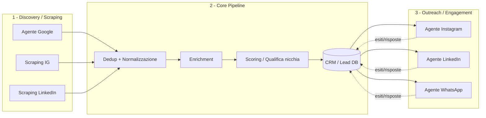
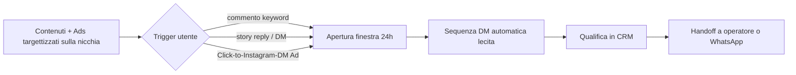
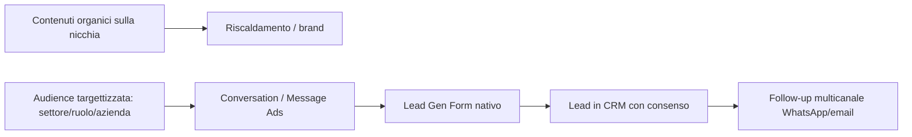
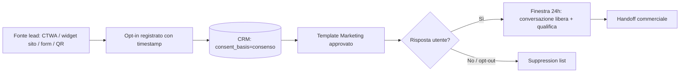
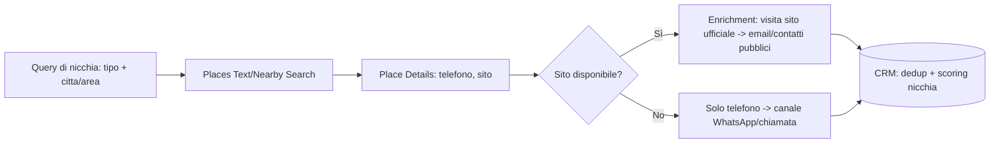
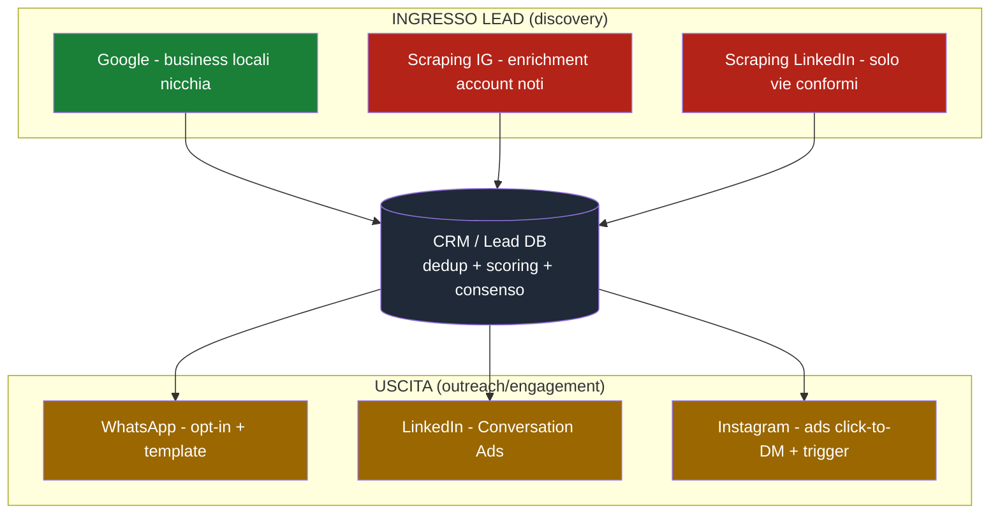

# Agenti Social per Lead Generation & Outreach — Struttura, Fattibilità e Programma

> **Documento strategico e tecnico** — Cliente esterno (progetto **stand-alone**, NON collegato alla `agents-platform`).
> Obiettivo: costruire 6 agenti (Instagram, Scraping Instagram, LinkedIn, Scraping LinkedIn, WhatsApp, Google Scraping) per **reach-out + engagement verso lead freddi** e **ricerca/catalogazione lead** in una **nicchia di riferimento**.
> Base di analisi: **API ufficiali** di ogni piattaforma, stato aggiornato a **luglio 2026**.

---

## 0. Come leggere questo documento (legenda semaforo)

Ogni funzionalità è classificata in base a **cosa consentono davvero le API ufficiali**:

| Simbolo | Significato |
|:---:|---|
| 🟢 | **Conforme** — fattibile via API ufficiale, senza violare i Termini |
| 🟡 | **Conforme con vincoli forti** — fattibile, ma richiede opt-in, budget pubblicitario, App Review o verifiche |
| 🔴 | **NON consentito dall'API ufficiale** — l'obiettivo non è coperto; realizzabile solo con strumenti non ufficiali (rischio ban + legale) |

> ⚠️ **Verità di fondo, da mettere subito sul tavolo con il cliente.**
> Le API ufficiali di **Instagram** e **LinkedIn** **non permettono** il cold outreach di massa (DM non richiesti), l'auto-follow/like verso terzi, né lo scraping di follower e profili. Sono progettate per *customer care* e *advertising*, non per prospecting a freddo.
> **WhatsApp** e **Google** invece offrono percorsi ufficiali solidi — a patto di rispettare, rispettivamente, l'**opt-in obbligatorio** e i **limiti di caching/uso dei dati**.
> Il documento mostra, per ogni canale, **cosa è realmente fattibile** e **come ottenere lo stesso risultato di business in modo conforme**.

---

## 1. Executive Summary — la fattibilità in una tabella

| Agente | Obiettivo | API ufficiale | Fattibilità obiettivo così com'è | Percorso consigliato |
|---|---|---|:---:|---|
| **Instagram (outreach)** | Cold DM + engagement | Instagram Messaging / Graph API | 🔴 Cold DM vietato | Ads "click-to-DM" + trigger da commento/story (finestra 24h) |
| **Scraping Instagram** | Trovare lead in nicchia | Business Discovery + Hashtag Search | 🔴 No liste follower/PII | Discovery su username noti + provider dati + lead ads |
| **LinkedIn (outreach)** | Cold DM + engagement | Marketing API (Conversation Ads) | 🟡 Solo a pagamento (CPS) | Conversation/Message Ads + contenuti organici + Lead Gen Forms |
| **Scraping LinkedIn** | Trovare lead in nicchia | *(nessuna API di ricerca persone)* | 🔴 Scraping vietato | Lead Gen Forms + Sales Navigator (manuale) + data provider in licenza |
| **WhatsApp (messaggistica)** | Campagne + engagement | WhatsApp Cloud API | 🟡 Solo con opt-in | Template Marketing + funnel opt-in (CTWA, widget, form) |
| **Google (scraping)** | Trovare lead in nicchia | Places API (New) + Custom Search | 🟢 Business B2B locali | Places Text/Nearby Search → enrichment sito → CRM |

**In sintesi:** la "macchina" più solida e conforme è **Google (discovery) → enrichment → WhatsApp (con opt-in) / LinkedIn Ads (a pagamento)**. Instagram e LinkedIn "a freddo" via bot esistono ma vivono fuori dalle API ufficiali, con rischio concreto di ban e responsabilità legale (vedi §11).

---

## 2. Architettura comune degli agenti

Tutti e 6 gli agenti condividono lo **stesso scheletro a pipeline**. Ogni agente è un *worker* specializzato che alimenta un unico **CRM/Data Lake di lead**.

### 2.1 Fasi comuni

1. **Discovery / Scraping** — gli agenti "scraping" raccolgono candidati lead.
2. **Dedup & Normalizzazione** — chiave univoca (dominio, telefono E.164, handle), merge dei duplicati cross-canale.
3. **Enrichment** — completamento dati (sito, email, settore, dimensione, canali social).
4. **Scoring / Qualifica** — filtro sulla nicchia (regole + LLM classifier) → `hot / warm / cold / scarto`.
5. **Consenso & Suppression** — registrazione base giuridica (GDPR), liste opt-out/DNC, blacklist.
6. **Outreach / Engagement** — gli agenti di canale eseguono le sequenze **entro i limiti dell'API**.
7. **Feedback loop** — risposte, bounce, opt-out ritornano nel CRM e aggiornano lo scoring.

### 2.2 Modello dati minimo (schema `leads`)

| Campo | Tipo | Note |
|---|---|---|
| `lead_id` | uuid | PK |
| `source` | enum | `google` / `ig_scrape` / `li_scrape` / `manual` / `ad_form` |
| `niche_tags` | text[] | classificazione nicchia |
| `company_name` | text | |
| `website` | text | |
| `email` | text | base giuridica obbligatoria (GDPR) |
| `phone_e164` | text | per WhatsApp |
| `ig_handle` / `li_url` | text | identificatori social |
| `score` | int | 0–100 |
| `status` | enum | `new / qualified / contacted / replied / opted_out / won / lost` |
| `consent_basis` | enum | `legittimo_interesse / consenso / n_a` |
| `consent_ts` | timestamptz | timestamp opt-in (per WhatsApp/email) |
| `suppressed` | bool | opt-out / DNC |
| `last_touch_at` | timestamptz | per rispettare frequency cap |

> **Nota GDPR (cliente UE):** ogni record che contiene dati personali (email, telefono, profilo di una **persona fisica**) deve avere una **base giuridica** documentata (legittimo interesse per il B2B, consenso per WhatsApp/email marketing) e un meccanismo di **opt-out** sempre attivo. Vedi §11.

### 2.3 Stack tecnico consigliato

- **Runtime agenti:** Python 3.12 (worker) — coerente con lo stack già in uso nel repo.
- **Orchestrazione/coda:** un job queue (es. Redis/RQ o Celery) + scheduler per rispettare rate limit e finestre orarie.
- **Storage:** Postgres/Supabase per il CRM lead; storage oggetti per allegati/log.
- **"Cervello" degli agenti:** LLM (Claude) per classificazione nicchia, personalizzazione copy, parsing pagine, gestione risposte.
- **Segreti/token:** vault per token OAuth (rotazione), un'app Meta e un'app LinkedIn dedicate al cliente.
- **Osservabilità:** logging strutturato per ogni chiamata API (endpoint, quota residua, esito) — indispensabile per non superare i rate limit.

---

## 3. 🟠 Agente Instagram — Outreach & Engagement

### 3.1 API ufficiali disponibili
- **Instagram API** con *Instagram Login* (diretto) o con *Facebook Login* (Graph API). Richiede account **Business/Creator** (Professional).
- Prodotti: *Content Publishing*, *Comment Moderation*, *Mentions*, *Hashtag Search*, *Business Discovery*, *Insights*, **Instagram Messaging** (Messenger Platform).

### 3.2 🟢 Cosa puoi fare (conforme)
- Pubblicare post/reel/storie (limite ~25 contenuti/24h).
- Leggere e **rispondere ai commenti** sui propri contenuti; nascondere/eliminare.
- Ricevere e **rispondere ai DM in ingresso** entro la **finestra di 24h** dall'ultima interazione dell'utente.
- Automazioni tipo "commenta *PAROLA* → ricevi DM": **lecite** perché l'utente *inizia* l'interazione (apre lui la finestra 24h). È il modello ManyChat/CreatorFlow.
- Rispondere a *story reply* e *mention*.
- Leggere gli **insight** del proprio account.

### 3.3 🔴 Cosa NON puoi fare via API ufficiale
- **Inviare DM a freddo** a utenti che non ti hanno scritto/interagito → *vietato*. Nessun endpoint per DM non richiesti.
- **Follow / unfollow** programmatico verso terzi → nessun endpoint.
- **Like / commento automatico** sui post di *altri* → nessun endpoint.
- Vedere/estrarre la **lista follower** di altri account.
- Il tag `HUMAN_AGENT` (estende la finestra a 7 giorni) è valido **solo per risposte di un operatore umano**: usarlo per bot è esplicitamente vietato e rilevato da Meta.

> **Conclusione:** l'obiettivo "campagne di reach-out a freddo + engagement verso lead freddi" **non è realizzabile con l'API ufficiale di Instagram**. L'API serve a *convertire in caldo* chi ti contatta, non a contattare a freddo.

### 3.4 Requisiti tecnici
- App su Meta for Developers + **Business Verification**.
- **App Review** per permessi avanzati (es. `instagram_business_manage_messages`, `instagram_business_basic`).
- Rate limit di piattaforma (≈ chiamate/ora proporzionali agli utenti) e limiti messaging (indicativamente ~200 msg/ora nella finestra aperta).

### 3.5 Come raggiungere l'obiettivo in modo conforme (architettura consigliata)
Trasformare il "cold" in "opted-in" e lasciar aprire all'utente la finestra 24h:

- **Ads "Click-to-Instagram-Direct"** (via Marketing API/Ads Manager): l'utente che clicca *apre lui* la conversazione → puoi rispondere con sequenze automatiche. È il canale "a freddo" **conforme**.
- **Comment/Story trigger** con keyword → DM automatico (lecito).
- **Engagement organico** manuale/assistito (l'agente prepara i contenuti e le risposte, l'azione verso terzi resta umana).

### 3.6 🔴 Alternative non ufficiali (solo per trasparenza sui rischi)
Esistono strumenti di automazione basati su sessioni browser/mobile non ufficiali (auto-DM, auto-follow, scraping). **Violano i Termini Instagram**, portano a **shadowban / ban dell'account** e — su dati di persone UE — espongono a **responsabilità GDPR**. **Non consigliati** come infrastruttura per un cliente.

---

## 4. 🔴 Agente Scraping Instagram — Ricerca lead

### 4.1 API ufficiali disponibili
- **Business Discovery** — dati pubblici di un account **Professional**, **conoscendone già lo username**.
- **Hashtag Search** — media recenti/top per hashtag (max **30 hashtag unici / 7 giorni** per account).

### 4.2 🟢 / 🟡 Cosa puoi fare (conforme)
- **Business Discovery** (dato uno username Professional) restituisce: `username`, `name`, `biography`, `website`, `profile_picture_url`, `followers_count`, `follows_count`, `media_count` e, per i media, `caption`, `like_count`, `comments_count`, `media_type`, `permalink`, `timestamp`. 🟡
- **Hashtag Search**: individua media pubblici per hashtag di nicchia (per capire *chi crea contenuti* su un tema). 🟡

### 4.3 🔴 Cosa NON puoi fare via API ufficiale
- **Cercare utenti per criteri** (bio, località, keyword) in modo arbitrario → nessun endpoint di ricerca persone.
- Estrarre **liste follower** di un account.
- Ottenere **email/telefono** (salvo ciò che l'account espone pubblicamente in bio).
- Costruire un database di profili personali via scraping.

> **Conclusione:** l'API ufficiale è utile per **arricchire** account già noti e per **capire la nicchia via hashtag**, ma **non** per generare liste di lead a freddo.

### 4.4 Come raggiungere l'obiettivo in modo conforme
- **Seed list** di account (competitor, hashtag, community) → **Business Discovery** per arricchire i profili business. 🟡
- **Instagram/Facebook Lead Ads**: raccolta lead *con consenso* (form nativo) — il modo pulito per ottenere contatti in nicchia. 🟢
- **Meta Content Library / Ad Library**: intelligence su chi fa advertising nella nicchia. 🟢
- **Provider dati in licenza** (con propria compliance e DPA) per l'enrichment. 🟡

### 4.5 🔴 Alternative non ufficiali
Scraper di follower/hashtag di terze parti: veloci ma **contro i Termini**, con dati spesso non aggiornati e **problemi GDPR** (raccolta massiva di dati personali senza base giuridica). Da valutare con estrema cautela e parere legale.

---

## 5. 🟡 Agente LinkedIn — Outreach & Engagement

### 5.1 API ufficiali disponibili
- **Marketing Developer Platform** (accesso su richiesta/approvazione): **Message Ads** e **Conversation Ads** (Sponsored Messaging), **Lead Gen Forms**, gestione Company Page, **posting organico** (Posts/Share API), Community Management, Analytics.
- **Sign In with LinkedIn (OIDC)**: autenticazione + profilo base del **solo utente consenziente**.

### 5.2 🟡 Cosa puoi fare (conforme)
- **Conversation Ads / Message Ads**: recapitare **messaggi personalizzati nella inbox** di membri targettizzati (per settore, ruolo, azienda, seniority). Modello **CPS** (paghi per messaggio recapitato). È il modo **ufficiale** di fare "reach-out" su LinkedIn.
  - Fino a **25** contenuti in una conversazione; opt-out obbligatorio; frequency cap per destinatario.
  - Obiettivo `LEAD_GENERATION` supportato → **Lead Gen Forms** integrati.
- **Pubblicazione contenuti organici** su profilo/pagina (thought leadership sulla nicchia).
- **Analytics** su pagina e campagne.

### 5.3 🔴 Cosa NON puoi fare via API ufficiale
- **Richieste di collegamento automatiche** → nessun endpoint.
- **Messaggi diretti membro-a-membro** (InMail "gratis"/organici automatizzati) → nessun endpoint pubblico.
- **Ricerca persone** / lettura profili di membri arbitrari → nessun endpoint.
- **Scraping di profili**: **esplicitamente vietato** dallo User Agreement (LinkedIn banna attivamente i tool di automazione).

### 5.4 Requisiti tecnici
- **LinkedIn Developer App** + richiesta di accesso al **Marketing Developer Platform** (processo di approvazione).
- **Ad Account** e budget (le Conversation Ads sono a pagamento, CPS).
- OAuth con scope adv/lead per la gestione campagne e il retrieval dei lead.

### 5.5 Architettura consigliata

- L'agente LinkedIn **prepara e gestisce** campagne di Sponsored Messaging + calendario editoriale organico, e **importa i lead** dai Lead Gen Forms.
- L'engagement "1-a-1" a freddo (connection request, InMail manuali) resta **azione umana**, eventualmente *assistita* dall'agente (che scrive il copy) ma **non automatizzata via bot**.

### 5.6 🔴 Alternative non ufficiali
Tool tipo automazione connection/InMail e scraper di profili: **violano lo User Agreement**, rischiano **restrizione/ban** dell'account (anche del profilo personale usato) e, sui dati UE, **sanzioni GDPR**. Sconsigliati per un'infrastruttura cliente.

---

## 6. 🔴 Agente Scraping LinkedIn — Ricerca lead

### 6.1 Situazione API ufficiale
- **Non esiste** un'API pubblica per la **ricerca di persone/aziende** né per la **lettura di profili** di membri non consenzienti.
- **Sales Navigator** è uno strumento **manuale** (le sue API sono riservate a partner CRM selezionati, non per prospecting self-service).
- Lo **scraping è vietato** dai Termini.

> **Conclusione:** l'obiettivo "scraping lead LinkedIn" **non ha un percorso via API ufficiale**.

### 6.2 Alternative conformi consigliate
- **LinkedIn Lead Gen Forms** (via Ads): lead di nicchia **con consenso**. 🟢
- **Sales Navigator** per la ricerca **manuale** e la costruzione di liste (senza export automatizzato). 🟡
- **Data provider B2B in licenza** (fornitori con DPA/consenso, es. database aziendali) per ottenere aziende/ruoli in nicchia → poi enrichment. 🟡
- **Google/Places** (§8) per identificare le aziende della nicchia, poi trovarne i profili LinkedIn manualmente. 🟢

### 6.3 🔴 Alternative non ufficiali
Scraper di ricerche/profili (headless browser, API non ufficiali): **contro i Termini**, storia legale nota (*hiQ v. LinkedIn*), rischio ban e **GDPR**. Non consigliati.

---

## 7. 🟡 Agente WhatsApp — Messaggistica & Engagement

### 7.1 API ufficiale
- **WhatsApp Business Platform — Cloud API** (ospitata da Meta), direttamente o tramite **BSP**.
- Richiede: **WABA** (WhatsApp Business Account), **Business Verification** Meta, **numero registrato**, **display name approvato**, **privacy policy** valida.

### 7.2 🟢 / 🟡 Cosa puoi fare (conforme)
- **Messaggi business-initiated** tramite **template approvati**, per categoria:
  - **Marketing** 🟡 (promozioni, offerte, re-engagement) — richiede **opt-in esplicito**, costo per messaggio più alto.
  - **Utility** 🟢 (conferme, aggiornamenti, notifiche) — opt-in, approvazione più snella.
  - **Authentication** 🟢 (OTP/codici).
- **Finestra di assistenza 24h**: dopo che l'utente scrive, puoi rispondere **liberamente** (testo libero, media, bottoni, liste). 🟢
- **Messaggi interattivi** (quick reply, liste, CTA), media, cataloghi.
- **Click-to-WhatsApp Ads (CTWA)** per generare conversazioni **con consenso**. 🟢

### 7.3 🔴 Vincolo chiave: opt-in obbligatorio
- **Non puoi** messaggiare numeri che **non hanno dato consenso** a essere contattati su WhatsApp. Messaggi a numeri **acquistati/scrapati** = **violazione** della Business Messaging Policy → **ban del numero** e calo del *quality rating*.
- Serve **prova documentata dell'opt-in** (dove/quando/come).

### 7.4 Requisiti e limiti operativi
- **Messaging limits** a scaglioni (1K → 10K → 100K → illimitati destinatari/24h) legati al **quality rating**.
- **Pricing per messaggio** (dal 2025 il modello è *per-message*, con tariffe per categoria e per paese; Marketing costa più di Utility). Disponibile **MM Lite API** per l'ottimizzazione dei messaggi marketing.
- Template soggetti ad **approvazione** e a **categorizzazione** automatica da parte di Meta.

### 7.5 Architettura consigliata (funnel opt-in → campagna)

- L'agente WhatsApp **gestisce l'opt-in**, invia **template** approvati, e conduce la conversazione **nella finestra 24h** (qualifica, FAQ, prenotazioni), con **opt-out** sempre disponibile.
- Per i "lead freddi" senza consenso: il primo touch **deve** essere un meccanismo di opt-in (es. **CTWA ads** sulla nicchia), non un messaggio a freddo.

> **Nota:** WhatsApp è il canale **più adatto** all'obiettivo "campagne di messaggistica", **ma** l'intera strategia dipende dalla **raccolta di opt-in**. Senza opt-in, non è una strada percorribile in modo conforme.

---

## 8. 🟢 Agente Google Scraping — Ricerca lead

### 8.1 API ufficiali
- **Places API (New)** — *Text Search*, *Nearby Search*, *Place Details*.
- **Custom Search JSON API** — ricerca web programmatica.
- (**Business Profile API** — solo per gestire *le proprie* schede, non per scraping.)

### 8.2 🟢 Cosa puoi fare (conforme) — il canale più solido per la discovery
- **Places Text/Nearby Search**: trovare **attività (business locali)** per **tipo + località** nella nicchia → ottieni `displayName`, `formattedAddress`, `location`, `types`, `businessStatus`, `rating`, `userRatingCount`.
- **Place Details**: `nationalPhoneNumber` / `internationalPhoneNumber`, **`websiteUri`**, orari, recensioni.
- **Custom Search JSON API**: trovare **siti web** che matchano query di nicchia (100 query/giorno gratis, poi a pagamento fino a ~10k/giorno) → base per l'enrichment.

### 8.3 🔴 / 🟡 Limiti da rispettare
- **Nessuna email** dai dati Places → l'email va reperita altrove (es. dal sito ufficiale dell'attività). 🟡
- **Restrizioni di caching (ToS Google Maps):** il **`place_id` è memorizzabile a tempo indeterminato**; **le coordinate fino a ~30 giorni**; gran parte del *content* Places **non può essere memorizzato in un database permanente** (requisiti di *display*/attribuzione). **Non** si può ricostruire un DB alternativo a Google. 🔴
- Costo per SKU/campo (field mask): richiedere solo i campi necessari per contenere i costi.

### 8.4 Architettura consigliata

- **Discovery** con Places → **enrichment** con Custom Search + visita al **sito ufficiale dell'attività** per i contatti **pubblicati dall'azienda stessa**.
- **Rispetto dei limiti di caching**: nel CRM si conserva `place_id` (permesso) e i dati *propri* del lead (telefono/sito raccolti e riverificati), evitando di "clonare" il database Places.

> **Nota GDPR sull'enrichment email:** raccogliere email **aziendali** pubblicate dall'azienda per una finalità B2B è generalmente sostenibile con il **legittimo interesse**, ma serve informativa + opt-out. Le email **di persone fisiche** (es. `nome.cognome@`) richiedono maggiore cautela. Vedi §11.

---

## 9. La "macchina" completa — come i 6 agenti lavorano insieme

L'insieme dei 6 agenti forma **un'unica pipeline di lead generation multicanale** per la nicchia:

**Flusso operativo per la nicchia:**
1. **Google** genera il grosso della lista (attività locali B2B della nicchia) — canale **più conforme e scalabile**.
2. **Enrichment** (sito → email/telefono pubblici, match social).
3. **Scoring/qualifica** con LLM sulla nicchia + suppression/consenso.
4. **Outreach**:
   - **WhatsApp** per chi ha dato **opt-in** (o via CTWA);
   - **LinkedIn Conversation Ads** per il target B2B (a pagamento);
   - **Instagram** via ads click-to-DM + trigger da engagement.
5. **Feedback** (risposte, opt-out) → aggiorna CRM e scoring.

---

## 10. Roadmap di implementazione (fasi)

| Fase | Contenuto | Output |
|---|---|---|
| **F0 — Setup & Legale** | App Meta + LinkedIn, verifiche business, WABA, DPA/informativa GDPR, liste suppression | Ambiente pronto e conforme |
| **F1 — Core Pipeline + Google** | CRM/lead DB, dedup, scoring LLM, **Agente Google** (Places + Custom Search) | Prime liste di nicchia qualificate |
| **F2 — WhatsApp** | WhatsApp Cloud API, template approvati, funnel opt-in (CTWA/widget) | Canale messaggistica conforme attivo |
| **F3 — LinkedIn** | Marketing API, Conversation/Message Ads, Lead Gen Forms, calendario organico | Reach-out B2B a pagamento attivo |
| **F4 — Instagram** | Ads click-to-DM, trigger commento/story, sequenze DM in finestra 24h | Engagement/DM conforme attivo |
| **F5 — Enrichment social** | Business Discovery IG, data provider in licenza, dashboard e reportistica | Arricchimento e ottimizzazione |

> **Priorità consigliata:** partire da **F1 (Google) + F2 (WhatsApp)** = massimo risultato con minimo rischio. LinkedIn/Instagram dopo, valutando budget ads e vincoli.

---

## 11. Rischi, compliance e raccomandazioni legali

> ⚠️ Sezione essenziale: l'obiettivo tocca **dati personali** e **piattaforme con Termini severi**. Il cliente opera (presumibilmente) in **UE** → si applica il **GDPR** e la **ePrivacy**.

### 11.1 Termini delle piattaforme
| Piattaforma | Cold outreach automatico | Scraping | Conseguenza violazione |
|---|:---:|:---:|---|
| Instagram | 🔴 vietato | 🔴 vietato | Shadowban / ban account |
| LinkedIn | 🔴 vietato (organico) | 🔴 vietato | Restrizione / ban (anche profilo personale) |
| WhatsApp | 🔴 senza opt-in | — | Ban del numero, calo quality rating |
| Google | — | 🟡 solo via API + limiti caching | Revoca API key |

### 11.2 GDPR / ePrivacy (UE)
- **Base giuridica obbligatoria** per ogni dato personale trattato:
  - **B2B / legittimo interesse**: sostenibile per contatti aziendali in target, **con** informativa e opt-out facile (bilanciamento documentato).
  - **Consenso**: **necessario** per WhatsApp/email marketing verso persone (opt-in esplicito e provabile).
- **Informativa privacy** e **registro dei trattamenti**; se si usano provider terzi (scraping/enrichment/BSP) servono **DPA**.
- **Diritto di opposizione/cancellazione**: suppression list sempre attiva; ogni messaggio con **opt-out**.
- **Dati scrapati**: la raccolta massiva di dati personali senza base giuridica è la principale fonte di **sanzioni**. Preferire **fonti con consenso** (lead ads, opt-in) e **dati aziendali pubblici** a target.

### 11.3 Raccomandazione strategica
- **Costruire l'infrastruttura sui canali conformi** (Google + WhatsApp opt-in + LinkedIn/IG Ads).
- Trattare gli approcci non ufficiali (bot di DM/scraping) come **fuori perimetro**: alto rischio operativo (ban) e legale (GDPR), non adatti a un servizio venduto a un cliente.
- Coinvolgere un **legale/DPO** per informativa, DPA con i provider e valutazione del legittimo interesse **prima** del go-live.

---

## 12. Appendice — Riepilogo endpoint principali per agente

| Agente | Endpoint/prodotto ufficiale chiave | Uso |
|---|---|---|
| Instagram (outreach) | Messaging (Send API, finestra 24h), Comment Moderation, Content Publishing | Rispondere/DM in finestra, moderare, pubblicare |
| Scraping IG | Business Discovery, Hashtag Search | Enrichment account noti, ricerca hashtag di nicchia |
| LinkedIn (outreach) | Conversation Ads API, Message Ads API, Lead Gen Forms, Posts API | Sponsored messaging, lead, contenuti |
| Scraping LinkedIn | *(nessuna API di ricerca/scraping)* → Lead Gen Forms | Lead con consenso |
| WhatsApp | Cloud API: Messages (template + free-form 24h), Message Templates, CTWA | Campagne opt-in, conversazioni |
| Google | Places API (Text/Nearby Search, Place Details), Custom Search JSON API | Discovery business locali, enrichment |

---

## 13. Fonti (verificate a luglio 2026)

- Instagram Messaging / finestra 24h / cold DM: [keyapi.ai](https://www.keyapi.ai/blog/instagram-messaging-api-policy/), [creatorflow.so](https://creatorflow.so/blog/instagram-dm-compliance-meta-rules/)
- Instagram Graph API (Business Discovery / Hashtag Search): [elfsight.com](https://elfsight.com/blog/instagram-graph-api-complete-developer-guide-for-2026/), [Instagram Official APIs reference (gist)](https://gist.github.com/jameschapman2c/65eff9f54a2d350b17a6ce5127b9fe42)
- LinkedIn Conversation/Message Ads: [Microsoft Learn — Conversation Ads API](https://learn.microsoft.com/en-us/linkedin/marketing/integrations/ads/advertising-targeting/version/conversation-ads-integrations), [Microsoft Learn — Message Ads API](https://learn.microsoft.com/en-us/linkedin/marketing/integrations/ads/advertising-targeting/version/message-ads-integrations)
- WhatsApp opt-in / template / pricing: [Meta for Developers — Template categorization](https://developers.facebook.com/documentation/business-messaging/whatsapp/templates/template-categorization), [wetarseel.ai](https://wetarseel.ai/whatsapp-business-api-opt-in-rules/), [ycloud.com](https://www.ycloud.com/blog/whatsapp-api-message-template-guide)
- Google Places API (dati/caching): [Google — Place Data Fields](https://developers.google.com/maps/documentation/places/web-service/data-fields), [Google — Places policies](https://developers.google.com/maps/documentation/places/web-service/policies), [bizcollect.dev](https://bizcollect.dev/blog/google-places-api-terms)

---

*Documento redatto come base di lavoro per il cliente esterno. Le API e le policy delle piattaforme cambiano frequentemente: prima del go-live rivalidare endpoint, limiti e Termini, e ottenere parere legale/DPO sul trattamento dati.*
