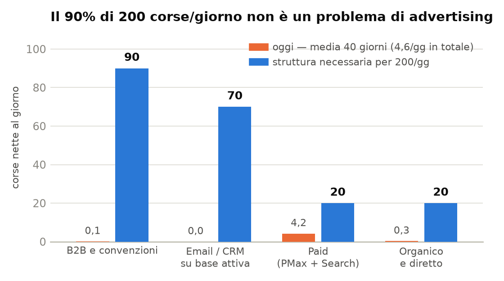
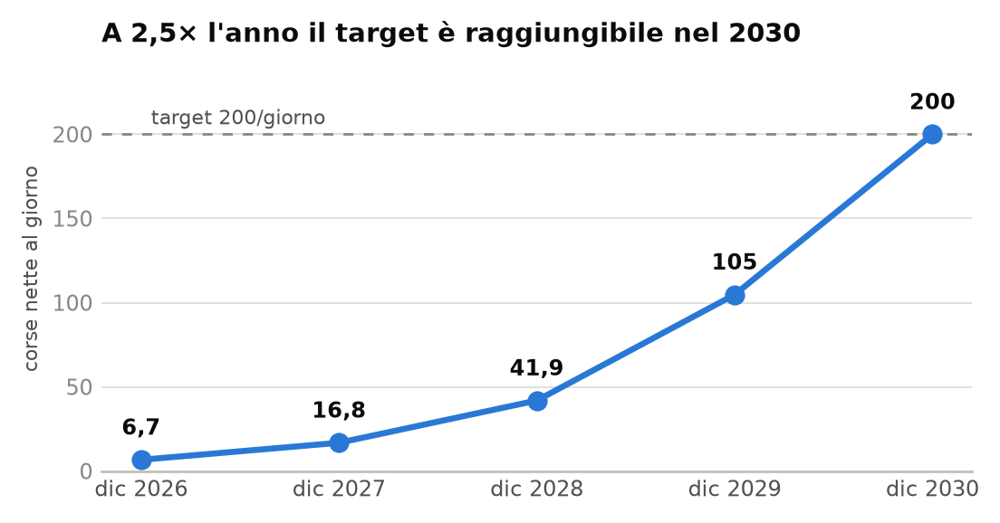
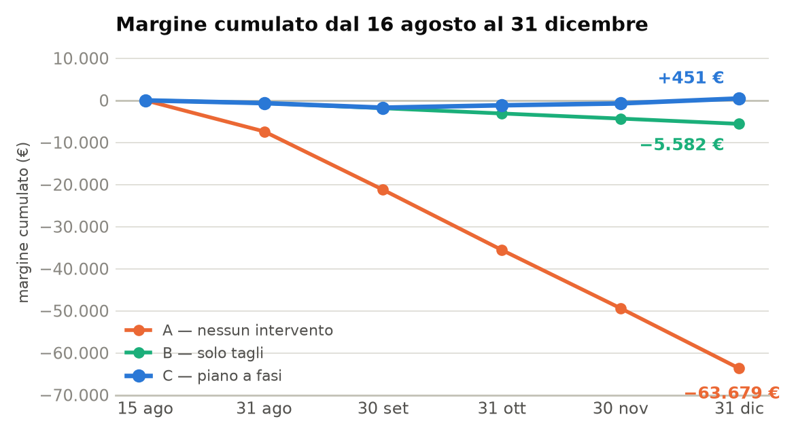
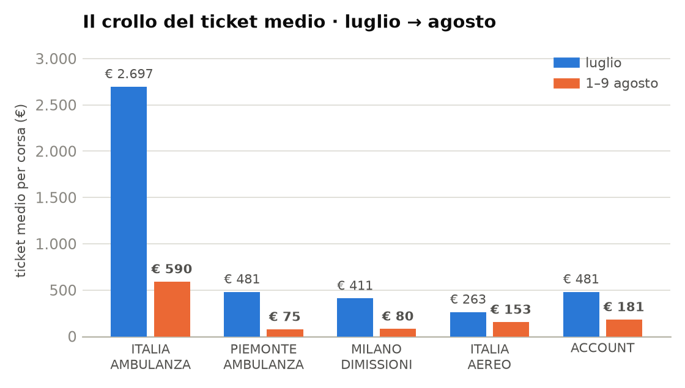
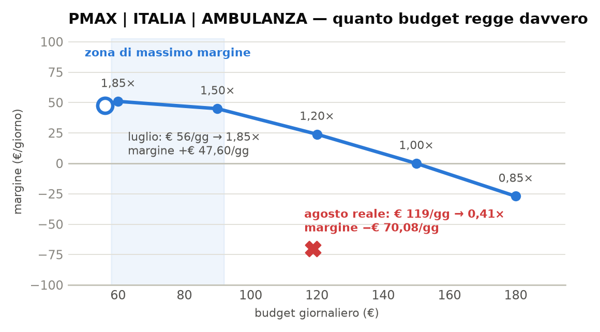
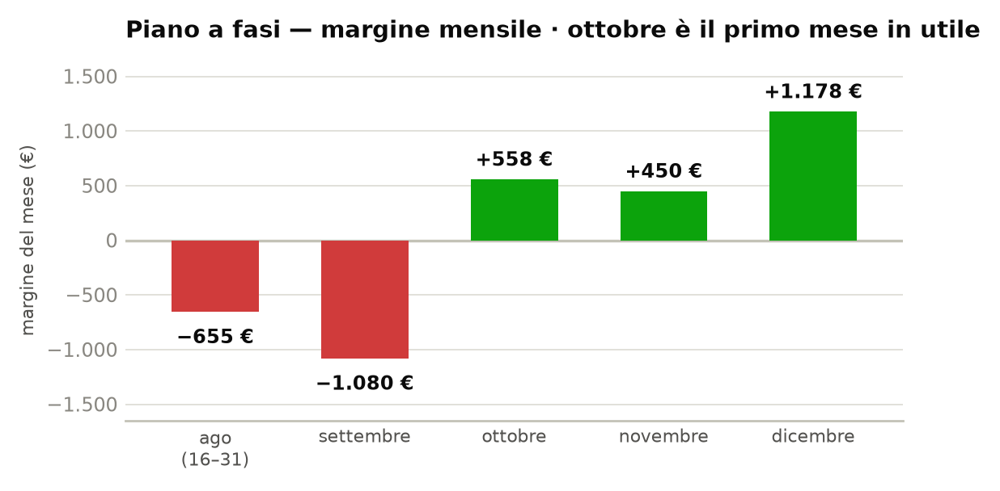
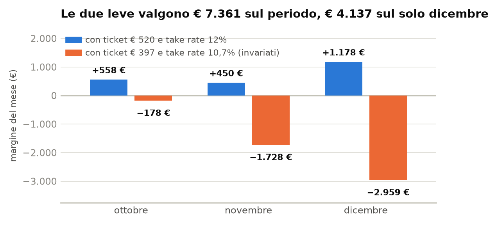
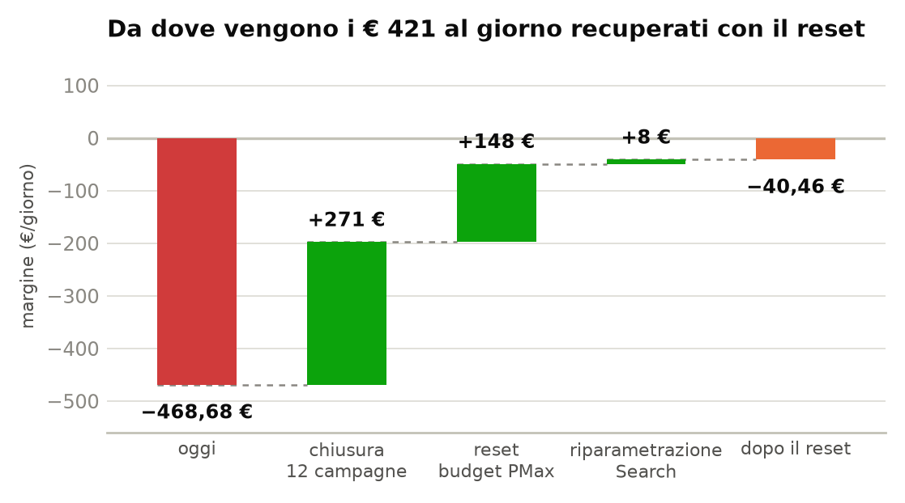
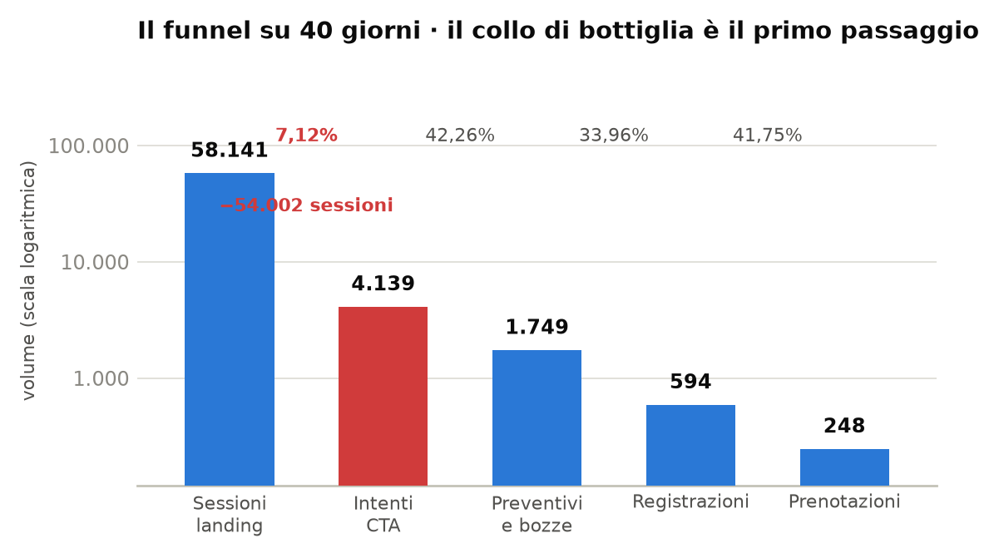
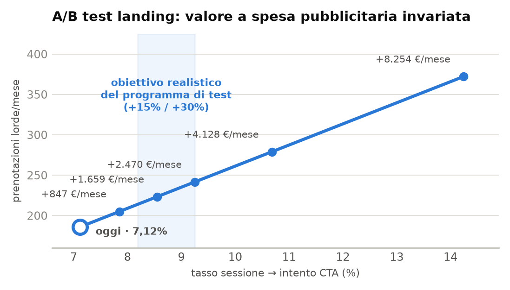

# Piano di Crescita verso 200 corse/giorno — 16 agosto → 31 dicembre 2026

**Data di riferimento:** 15 agosto 2026
**Orizzonte:** 138 giorni (16–31 agosto + settembre, ottobre, novembre, dicembre)
**Base dati:** report Niino 1/07–31/07 e 1/08–09/08 · export Google Ads 1/07–09/08
**Valuta:** EUR

---

## Avvertenza sulla base dati

**L'ultimo dato osservato è il 9 agosto. I sei giorni dal 10 al 15 agosto non sono
coperti da nessuna fonte.** Tutte le proiezioni partono dal run rate 1–9 agosto.

**Prima azione del piano, prima di ogni altra: estrarre un report Niino e un export
Google Ads aggiornati al 15 agosto.** Se il ticket medio è risalito o la spesa è calata,
le cifre vanno riparametrate — il metodo resta valido, i numeri no.

Su un orizzonte di 4 mesi e mezzo, inoltre, **una proiezione lineare non ha senso**. Il
piano è costruito a fasi, ciascuna con una condizione di ingresso verificabile: se una
fase non supera il proprio gate, si resta sulla precedente. Le proiezioni delle fasi 3–5
sono **condizionate**, non previste.

---

## 1. Il target dichiarato: 200 corse al giorno

| | Corse nette/giorno | Corse/anno |
|---|---:|---:|
| Oggi (run rate 1–9 agosto) | 5,78 | 2.110 |
| Piano dicembre 2026 | 6,71 | 2.449 |
| Target del business plan (192/mese) | 6,40 | 2.336 |
| **Target dichiarato** | **200** | **73.000** |

**Il target è 34,6 volte il livello attuale e 31 volte il target mensile del business
plan**, che parla di 192 corse al mese. Le due cifre non sono in contraddizione: il BP è
l'obiettivo operativo del 2026, le 200 al giorno sono l'obiettivo di scala dell'azienda.

### Perché non può arrivare dall'advertising

| CPA per corsa netta | Spesa/giorno | Spesa/mese |
|---|---:|---:|
| € 66,14 (piano, fase F0) | € 13.228 | € 396.840 |
| € 56,73 (piano, dicembre) | € 11.346 | € 340.380 |
| € 50,00 (ipotesi ottimistica) | € 10.000 | € 300.000 |
| **Budget mensile del BP** | | **€ 13.529** |

Servirebbero €300.000–400.000 al mese contro un budget di €13.529 — e la curva di
saturazione mostra che la campagna migliore va in pareggio a €150/giorno. Al tasso di
conversione attuale (0,427%) servirebbero inoltre **46.888 sessioni al giorno** contro
le 1.454 di oggi.

*Il 90% del target non è un problema di advertising.*

| Canale | Corse/gg | Cosa serve |
|---|---:|---|
| **B2B e convenzioni** | **90** | Contratti ricorrenti con ospedali, cliniche, RSA, assicurazioni. Oggi vale 0,13 corse/giorno |
| **Email / CRM su base attiva** | **70** | 25.000–35.000 clienti attivi con una corsa l'anno. Oggi il canale non esiste |
| Paid — PMax + Search Purchase | 20 | Budget €1.000–1.200/giorno a CPA €50–60, con ticket ≥ €520 |
| Organico, diretto, passaparola | 20 | Cresce con la notorietà e la base clienti |
| **Totale** | **200** | |

*A 2,5× l'anno il target è raggiungibile nel 2030.*

**200 corse al giorno è un obiettivo a tre-quattro anni. Il traguardo di dicembre 2026
su quella strada è 6,7 corse al giorno.**

---

*Margine cumulato dal 16 agosto al 31 dicembre nei tre scenari.*

## 1. Il punto di partenza

| Metrica | Valore/giorno |
|---|---:|
| Spesa (Google + Meta) | € 567,67 |
| Fee Niino netta | € 106,22 |
| **Margine** | **−€ 461,44** |
| Corse nette | 5,78 |
| **ROAS Fee** | **0,19×** |
| CPA per corsa netta | € 98,25 |
| Ticket medio | € 181 |
| **Fee per corsa netta** | **€ 18,38** |

L'account brucia **€461 al giorno**. Ogni corsa costa €98 e ne rende €18.

---

## 2. Il vincolo strutturale che governa tutto il piano

Niino incassa la fee, non il GMV. Perché una corsa si ripaghi, **il costo di
acquisizione deve stare sotto la fee che quella corsa genera**:

> **fee per corsa = ticket medio × take rate**

Tutto il piano da qui a dicembre discende da questa identità.

| Base | Ticket | Take rate | Fee per corsa | = CPA di pareggio |
|---|---:|---:|---:|---:|
| Agosto (attuale) | € 181 | 10,7% | € 19,37 | **€ 19** |
| 40 giorni (1/7 – 9/8) | € 397 | 10,7% | € 42,48 | **€ 42** |
| Luglio | € 481 | 10,7% | € 51,47 | **€ 51** |
| **CPA reale attuale** | | | | **€ 98,25** |

*Il ticket medio è crollato su ogni campagna: Piemonte e Aereo hanno prodotto più corse ad agosto che a luglio, a valore per corsa molto inferiore.*

### Il target del business plan è sopra la soglia di pareggio

Il BP fissa un CPA target di **€70**. In nessuno scenario misurato quel CPA produce
margine: servirebbe una fee di €70 per corsa, cioè — al take rate del 10,7% — **un
ticket medio di €654**.

> **Conseguenza strategica per i prossimi quattro mesi: la crescita del budget non è una
> decisione autonoma. È una funzione del ticket medio e del take rate.** Aumentare la
> spesa prima che quei due numeri si muovano moltiplica le perdite, come dimostrato ad
> agosto.

### Quanto budget regge davvero la campagna migliore

Punti osservati su `PMAX | ITALIA | AMBULANZA`, con la curva di saturazione che ne
deriva:

| Budget/giorno | ROAS Fee | Fee/giorno | Margine/giorno | |
|---:|---:|---:|---:|---|
| € 56 | **1,85×** | € 103,60 | **+€ 47,60** | osservato — luglio |
| € 60 | 1,85× | € 111,00 | **+€ 51,00** | assunto |
| € 90 | 1,50× | € 135,00 | +€ 45,00 | assunto |
| € 120 | 1,20× | € 144,00 | +€ 24,00 | assunto |
| € 150 | 1,00× | € 150,00 | € 0 | **tetto di pareggio** |
| € 119 | **0,41×** | € 48,70 | **−€ 70,08** | osservato — agosto, con tCPA e tracciamento rotti |

*A €56/giorno la campagna rendeva 1,85×; portata a €119 è scesa a 0,41×.*

**La zona di massimo margine è €60–90 al giorno, non il budget massimo.** Oltre €150 la
campagna va in perdita anche nel migliore dei casi. Agosto ha provato a spendere €119 e
ha ottenuto 0,41×.

**Questo è il tetto strutturale da rimuovere, e non si rimuove con il budget: si rimuove
alzando il ticket medio e il take rate.**

---

## 3. I tre scenari a 138 giorni

| Scenario | Spesa | Fee | **Margine** | ROAS Fee | Corse nette |
|---|---:|---:|---:|---:|---:|
| **A — inerziale** (nessun intervento) | € 78.338 | € 14.659 | **−€ 63.679** | 0,19× | 797 |
| **B — solo tagli** (nessun miglioramento di efficienza) | € 26.910 | € 21.328 | **−€ 5.582** | 0,79× | 502 |
| **C — piano a fasi** | € 37.175 | € 37.626 | **+€ 451** | **1,01×** | **712** |

**La differenza tra non fare nulla e fare il piano è di €64.130 su 138 giorni.**

Includendo i €12.510 già persi dal 1 luglio al 9 agosto:

| | Margine cumulato 1/7 – 31/12 |
|---|---:|
| Scenario A | **−€ 76.189** |
| Scenario C | **−€ 12.059** |

**Lo scenario C non recupera le perdite già fatte, ma le ferma:** da metà agosto a fine
dicembre il piano chiude in pareggio, con dicembre in utile.

---

## 4. Il piano a fasi

Ogni fase ha una **condizione di ingresso**. Se non è soddisfatta, non si passa alla
successiva: si resta sulla precedente e si lavora sul blocco.

| Fase | Periodo | Giorni | Budget/gg | ROAS Fee | Spesa | Fee | **Margine** |
|---|---|---:|---:|---:|---:|---:|---:|
| **F0 — Reset** | 16–31 ago | 16 | € 195 | 0,79× | € 3.120 | € 2.465 | −€ 655 |
| **F1 — Riparazione** | 1–15 set | 15 | € 195 | 0,70× | € 2.925 | € 2.047 | −€ 878 |
| **F2 — Recupero** | 16–30 set | 15 | € 225 | 0,94× | € 3.375 | € 3.172 | −€ 202 |
| **F3 — Efficienza** | ottobre | 31 | € 225 | **1,08×** | € 6.975 | € 7.533 | **+€ 558** |
| **F4 — Prima crescita** | novembre | 30 | € 300 | 1,05× | € 9.000 | € 9.450 | **+€ 450** |
| **F5 — Scale** | dicembre | 31 | € 380 | 1,10× | € 11.780 | € 12.958 | **+€ 1.178** |
| **Totale** | | **138** | | **1,01×** | **€ 37.175** | **€ 37.626** | **+€ 451** |

*Ottobre è il primo mese in utile; dicembre porta il cumulato in positivo.*

### Vista mensile e traiettoria cumulata

| Mese | Spesa | Fee | Margine | ROAS Fee | Corse nette | **Cumulato** |
|---|---:|---:|---:|---:|---:|---:|
| agosto (16–31) | € 3.120 | € 2.465 | −€ 655 | 0,79× | 58 | −€ 655 |
| settembre | € 6.300 | € 5.220 | −€ 1.080 | 0,83× | 116 | −€ 1.735 |
| **ottobre** | € 6.975 | € 7.533 | **+€ 558** | **1,08×** | 160 | −€ 1.177 |
| novembre | € 9.000 | € 9.450 | +€ 450 | 1,05× | 171 | −€ 727 |
| **dicembre** | € 11.780 | € 12.958 | **+€ 1.178** | 1,10× | **208** | **+€ 451** |

**Ottobre è il primo mese in utile. Dicembre è il mese in cui il cumulato torna
positivo.** Non prima: settembre resta in perdita per costruzione, perché è il mese in
cui si rompono e si ricostruiscono le conversioni.

### Dicembre contro il business plan

| | Piano | Target BP | Scostamento |
|---|---:|---:|---:|
| Corse nette | **208** | 192 | **+8%** |
| Spesa | € 11.780 | € 13.529 | **−13%** |
| CPA per corsa netta | € 56,73 | € 70 | −19% |
| Margine | **+€ 1.178** | — | — |

**Il piano raggiunge il target di volume del BP a dicembre, spendendo il 13% in meno e
in utile.** Ma solo perché nel frattempo il ticket medio e il take rate si sono mossi —
non perché si è spinto sul budget.

---

## 5. Le due leve che decidono se il piano funziona

Le fasi 3, 4 e 5 poggiano su due assunzioni dichiarate. **Non sono previsioni: sono
condizioni.**

| | Oggi | F2–F3 | F4 | F5 |
|---|---:|---:|---:|---:|
| **Ticket medio** | € 181 | € 440 | € 480 | **€ 520** |
| **Take rate** | 10,7% | 10,7% | 11,5% | **12,0%** |
| Fee per corsa | € 19,37 | € 47,08 | € 55,20 | **€ 62,40** |

*Stessi budget e stesse corse, ma con ticket e take rate invariati: dicembre passa da +€1.178 a −€2.959.*

### Sensibilità: cosa succede se le leve non si muovono

Stessi budget, stesse corse, ma ticket fermo a €397 e take rate al 10,7%:

| Fase | Margine con le leve | **Margine senza le leve** | Differenza |
|---|---:|---:|---:|
| F3 — ottobre | +€ 558 | **−€ 178** | −€ 736 |
| F4 — novembre | +€ 450 | **−€ 1.728** | −€ 2.178 |
| F5 — dicembre | +€ 1.178 | **−€ 2.959** | −€ 4.137 |
| **Totale 138 gg** | **+€ 451** | **−€ 6.910** | **−€ 7.361** |

**Le due leve valgono €7.361 sul periodo, di cui €4.137 sul solo dicembre.** Senza di
esse il piano non arriva al pareggio: si ferma a un risultato simile allo scenario B.

### Leva 1 — ticket medio

Ogni **€100 di ticket medio in più valgono €10,70 di CPA sostenibile in più**. Dove si
trova il ticket alto, dai dati dei 40 giorni:

| Campagna | Ticket medio | Corse |
|---|---:|---:|
| **PMAX \| ITALIA \| AMBULANZA** | **€ 1.994** | 21 |
| SEARCH \| MILANO \| DIMISSIONI | € 374 | 9 |
| PMAX \| PIEMONTE \| AMBULANZA | € 253 | 32 |
| SEARCH \| CHIAMATA \| LUNGA PERCORRENZA | € 234 | 7 |
| PMAX \| ITALIA \| AEREO | € 192 | 23 |
| SEARCH \| AMBULANZA \| PURCHASE \| MILANO | € 151 | 18 |

**Il ticket alto è sui trasferimenti nazionali a lunga distanza, non sulle regionali.**
La direzione di crescita per il Q4 è allargare il raggio e la lunghezza della tratta,
non moltiplicare le città.

### Leva 2 — take rate

Il take rate medio è **10,7%** e varia dal 6,8% al 20,0% per campagna. La campagna con
il ticket più alto ha **il take rate più basso: 8,7%**.

Portare `PMAX | ITALIA | AMBULANZA` dall'8,7% al 12% vale **+38% di fee a parità di
tutto il resto**, e ne porta il ROAS Fee da 1,30× a 1,79× **senza toccare una sola
impostazione di campagna**.

**È una leva commerciale, non pubblicitaria.** Va portata a chi definisce le condizioni
economiche sui trasferimenti a lunga percorrenza, e va decisa entro settembre perché le
fasi 4 e 5 la assumono già acquisita.

### Cosa serve per arrivare a €500/giorno di budget

| Ticket | Take rate | Fee per corsa | Corse/giorno necessarie a ROAS Fee 1,2× |
|---:|---:|---:|---:|
| € 397 | 10,7% | € 42,48 | **14,1** |
| € 481 | 10,7% | € 51,47 | 11,7 |
| € 520 | 12,0% | € 62,40 | **9,6** |
| € 650 | 12,0% | € 78,00 | 7,7 |

Oggi le corse sono **5,78 al giorno**. Il piano ne prevede 6,7 a dicembre. **Un budget
da €500/giorno non è raggiungibile entro l'anno in nessuna combinazione realistica**: è
un obiettivo per il 2027, e passa dal ticket, non dalla spesa.

---

## 6. Il calendario operativo

### F0 — Reset · 16–31 agosto

| # | Azione | Effetto |
|---|---|---|
| 1 | **Estrarre report Niino e export Google Ads al 15 agosto** | Verifica della base. Blocca tutto il resto se i numeri sono cambiati |
| 2 | **Chiudere 12 campagne** (elenco §7) | +€271/giorno di margine, immediato |
| 3 | **Riportare `PMAX \| ITALIA \| AMBULANZA` a €60/giorno** | Torna nella zona di massimo margine della curva |
| 4 | **Ridurre Piemonte a €30 e Aereo a €25** | −€62/giorno su campagne a 0,16× e 0,39× |
| 5 | **Rimuovere "Calls from ads" dalle conversioni di offerta** | Elimina ~50% di doppio conteggio dai CPA target |
| 6 | **Chiarire la campagna in pausa che ha speso €755** | Anomalia irrisolta |

**Gate per F1:** nessuno — F1 parte comunque.

### F1 — Riparazione della misurazione · 1–15 settembre

| # | Azione |
|---|---|
| 7 | **Importare le 4 azioni a zero**: prenotazione, GMV, signup, conversazione |
| 8 | **Importare le cancellazioni** come conversione negativa o rettifica di valore |
| 9 | **Verificare l'attribuzione di Niino Revenue per campagna** (copertura oggi dal 20% al 183%) |
| 10 | **Rifare gli asset di Piemonte** e affrontare il 29% di cancellazioni |
| 11 | **Portare la leva take rate alla direzione commerciale** — decisione entro il 30 settembre |

> **Il ROAS Fee scende in questa fase (0,79× → 0,70×) ed è previsto.** Cambiare le azioni
> di conversione azzera lo storico di apprendimento delle campagne. Va fatto tutto
> insieme in una finestra di due settimane, non spalmato: due settimane di instabilità
> sono il prezzo di tre mesi di dati corretti.

**Gate per F2:** le 4 azioni di conversione registrano dati in Google Ads e le
cancellazioni rientrano. Se non è così, F2 slitta.

### F2 — Recupero · 16–30 settembre

| # | Azione |
|---|---|
| 12 | **`PMAX \| ITALIA \| AMBULANZA` da €60 a €90/giorno**, in due step da +25% a una settimana di distanza |
| 13 | **Passaggio da CPA target a Massimizza il valore di conversione** — solo ora, mai prima del punto 7 |
| 14 | **Test di riattivazione di `SEARCH \| AMBULANZA \| PURCHASE \| MILANO` a €25/giorno** |
| 15 | **Stop automatico:** se il ROAS Fee settimanale scende sotto 1,2× su Italia Ambulanza, si torna a €60 lo stesso giorno |

**Gate per F3:** ROAS Fee di portafoglio ≥ 0,90× e ticket medio ≥ €400 nelle ultime due
settimane.

### F3 — Efficienza · ottobre

| # | Azione |
|---|---|
| 16 | **Nessun aumento di budget per tutto il mese.** Si resta a €225/giorno |
| 17 | **Consolidare le Search Purchase superstiti** in una struttura unica, come indicato nel report Search |
| 18 | **Verificare l'effetto delle correzioni di tracciamento** sulle offerte automatiche: è il mese in cui si misura se hanno funzionato |
| 19 | **Costruire il primo test sul ticket alto:** una campagna dedicata ai trasferimenti a lunga percorrenza nazionali, budget €30/giorno, separata dal resto |

**Gate per F4:** ottobre chiude con ROAS Fee ≥ 1,0× **e** la decisione sul take rate è
presa.

### F4 — Prima crescita · novembre

| # | Azione |
|---|---|
| 20 | **Budget da €225 a €300/giorno**, in tre step settimanali da +10% |
| 21 | **Applicare il nuovo take rate** sui trasferimenti a lunga percorrenza |
| 22 | **Scalare il test sul ticket alto** se ha ROAS Fee ≥ 1,5×: da €30 a €80/giorno |
| 23 | **Verifica settimanale obbligatoria:** ogni step di budget si conferma solo se il ROAS Fee della settimana precedente è ≥ 1,0× |

**Gate per F5:** novembre chiude con ROAS Fee ≥ 1,0× e ticket medio ≥ €480.

### F5 — Scale · dicembre

| # | Azione |
|---|---|
| 24 | **Budget da €300 a €380/giorno** |
| 25 | **Riaprire selettivamente** una o due delle campagne chiuse in F0, solo se il canale Search a chiamata ha una fee per chiamata rimisurata sopra €10 |
| 26 | **Consuntivo al 31 dicembre** e piano 2027 sul ticket, non sul budget |

---

## 7. Le 12 campagne da chiudere in F0

| Campagna | Spesa/gg oggi |
|---|---:|
| SEARCH \| AMBULANZA \| CHIAMATA \| ROMA | € 86,89 |
| SEARCH \| CHIAMATA \| LUNGA PERCORRENZA (attiva) | € 51,89 |
| SEARCH \| AMBULANZA \| CHIAMATA \| PUGLIA | € 29,67 |
| SEARCH \| AMBULANZA \| CHIAMATA \| MILANO | € 21,56 |
| IG - FOLLERS (Meta) | € 20,33 |
| PMAX \| LOMBARDIA \| AMBULANZA | € 19,67 |
| SEARCH \| AMBULANZA \| CHIAMATA \| TORINO | € 17,89 |
| SEARCH \| AMBULANZA \| CHIAMATA \| BOLOGNA | € 11,67 |
| SEARCH \| AMBULANZA \| CHIAMATA \| AGRIGENTO | € 9,11 |
| SEARCH \| AMBULANZA \| CHIAMATA \| BARI | € 6,33 |
| SEARCH \| AMBULANZA \| CHIAMATA \| VARESE 2 | € 4,33 |
| SEARCH \| CHIAMATA \| LUNGA PERCORRENZA (in pausa) | € 0 — *ma €755 nei 40 gg* |
| **Totale** | **€ 279,33/giorno** |

*Da dove vengono i €421/giorno recuperati con il reset.*

Nei 9 giorni di agosto queste campagne hanno prodotto **€7,89/giorno di fee**.
**Chiuderle libera €279/giorno e costa €8/giorno: +€271/giorno di margine.**

### Il portafoglio dopo il reset — 9 campagne

| Campagna | Oggi/gg | **F0/gg** | ROAS Fee | Fee/gg | Corse/gg |
|---|---:|---:|---:|---:|---:|
| PMAX \| ITALIA \| AMBULANZA | € 118,78 | **€ 60** | 1,30× | € 78,00 | 0,45 |
| PMAX \| PIEMONTE \| AMBULANZA | € 66,22 | **€ 30** | 0,61× | € 18,30 | 0,52 |
| PMAX \| ITALIA \| AEREO | € 51,11 | **€ 25** | 0,43× | € 10,75 | 0,54 |
| SEARCH \| AMBULANZA \| PURCHASE \| MILANO | € 5,89 | **€ 25** | 0,80× | € 20,00 | 0,47 |
| SEARCH \| AMBULANZA \| PURCHASE \| ROMA | € 1,22 | **€ 15** | 0,60× | € 9,00 | 0,44 |
| SEARCH \| MILANO \| DIMISSIONI | € 29,89 | **€ 20** | 0,51× | € 10,20 | 0,21 |
| SEARCH \| AMBULANZA \| CHIAMATA \| PALERMO | € 9,33 | **€ 10** | 0,45× | € 4,50 | 0,16 |
| SEARCH \| ANZIANI \| MILANO | € 0,56 | **€ 5** | 0,49× | € 2,45 | 0,10 |
| SN - 1225 - Brand | € 5,33 | **€ 5** | 0,27× | € 1,35 | 0,05 |
| **Totale** | € 288,33 | **€ 195** | **0,79×** | **€ 154,55** | **2,95** |

| | Oggi | Dopo F0 | Variazione |
|---|---:|---:|---:|
| Spesa/giorno | € 567,67 | **€ 195** | −66% |
| **Margine/giorno** | **−€ 461,44** | **−€ 40,45** | **+€ 421** |
| Corse nette/giorno | 5,78 | 2,95 | −49% |
| CPA per corsa | € 98,25 | € 66,14 | −33% |

**Il reset dimezza le corse.** È il costo del piano, e va accettato consapevolmente: si
recuperano a novembre (5,7/giorno) e si superano a dicembre (6,7/giorno), a un CPA
sostenibile invece che a €98.

---

## 6bis. Fee o GMV: quale valore passare a Google

Oggi a Google arriva **la fee di Niino, non il prezzo che paga il cliente**: il valore
trasmesso è circa **un nono** di quello della transazione (€7.963 di fee contro €73.383
di GMV netto sui 40 giorni).

**La configurazione attuale è quella giusta e va mantenuta.** Tre ragioni, tutte
verificabili sui dati dell'account.

### 1. Il take rate non è costante, quindi GMV e fee non sono proporzionali

| Campagna | Take rate | ROAS GMV | ROAS Fee |
|---|---:|---:|---:|
| PMAX \| ITALIA \| AMBULANZA | **8,7%** | **14,97×** | 1,30× |
| PMAX \| PIEMONTE \| AMBULANZA | 14,0% | 4,39× | 0,61× |
| SEARCH \| AMBULANZA \| PURCHASE \| ROMA | **17,7%** | 3,40× | 0,60× |
| SEARCH \| AMBULANZA \| CHIAMATA \| VARESE 2 | **20,0%** | 0,53× | 0,11× |

Il take rate varia dal 6,8% al 20,0% — un fattore tre. Sul GMV, Italia Ambulanza sembra
**4,4 volte** più efficiente di Purchase Roma; sulla fee lo è **2,2 volte**. **Il GMV ne
sovrastima il valore relativo del doppio**, e spingerebbe l'allocazione automatica verso
le corse su cui Niino trattiene di meno.

### 2. Con la fee il pareggio è 1,00× e non si può fraintendere

Passando il GMV, il pareggio si sposterebbe a **tROAS 9,22×**. L'account oggi è a 3,82×
sul GMV, cioè al **41% del pareggio** — ma un ROAS di 3,8× letto senza contesto sembra
un successo. Con la fee, 0,41× contro una soglia di 1,00× non lascia margine di
equivoco.

### 3. La fee è il conto economico di Niino

L'algoritmo massimizza ciò che gli si dà da massimizzare. Se gli si dà il transato,
ottimizza il transato — che è il ricavo dei fornitori, non il vostro.

### Cosa cambiare, però, su *quale* fee si passa

| # | Correzione | Perché |
|---|---|---|
| **a** | **Passare la fee netta delle cancellazioni** | Il 25,4% delle corse viene cancellato: il valore trasmesso oggi sovrastima la fee reale di circa il **34%**. Si risolve con le rettifiche di conversione (retrattazione all'annullamento) |
| **b** | **Aggiungere il GMV come azione secondaria, esclusa dalle offerte** | Dà la scala della piattaforma nei report senza entrare nel bidding |
| **c** | **Correggere l'attribuzione della fee per campagna** | La copertura oscilla dal 20% al 183%: è un problema più grave della scelta fee/GMV |

### Il problema più grande non è quale valore, ma quanti

**L'account genera 1,41 conversioni a valore al giorno.** Nessuna strategia a valore
impara con questo volume. La soluzione è una **scala di valori modellati sugli eventi
intermedi**: valore atteso = fee media × probabilità che l'evento diventi corsa.

| Evento | Eventi/giorno | P(prenotazione) | Valore modellato | Ruolo |
|---|---:|---:|---:|---|
| **Preventivo / bozza** | **43,7** | 14,18% | € 6,29 | segnale di volume |
| Registrazione | 14,8 | 41,75% | € 18,52 | segnale intermedio |
| **Prenotazione** | 6,2 | 100% | **€ 44,36** | verità economica |

**Con la scala il segnale valorizzato passa da 6,2 a 43,7 eventi al giorno: sette volte
tanto.** Regola per non falsare i conti: **una sola azione primaria per campagna** — la
più profonda che abbia volume sufficiente — e tutte le altre come secondarie di sola
osservazione.

> Il valore che state passando è quello giusto, e passare al GMV sarebbe un errore. Va
> reso netto delle cancellazioni, affiancato dal GMV in sola lettura, e accompagnato da
> una scala di valori sugli eventi intermedi — perché il limite oggi non è la scelta
> della metrica, è che le conversioni a valore sono 1,4 al giorno.

---

## 7bis. Programma di A/B test sulle landing page

*Su 58.141 sessioni in 40 giorni, 54.002 se ne vanno senza esprimere alcun intento.*

| Passaggio | Volume | Tasso | Lettura |
|---|---:|---:|---|
| Sessioni landing | 58.141 | — | |
| **→ Intento CTA** | **4.139** | **7,12%** | Il collo di bottiglia: −54.002 sessioni |
| → Preventivi e bozze | 1.749 | 42,26% | Sano |
| → Registrazioni | 594 | 33,96% | Da verificare: la registrazione è obbligatoria? |
| → Prenotazioni | 248 | 41,75% | Sano |
| **Sessione → prenotazione** | **248** | **0,427%** | |

**Il 92,88% delle sessioni non arriva a esprimere un intento.** Superato quel primo
scalino il funnel funziona: 4 su 10 di chi chiede un preventivo poi prenota.

### Cosa è statisticamente testabile

| Metrica di decisione | Baseline | Lift | Durata | Verdetto |
|---|---:|---:|---:|---|
| **Sessione → intento CTA** | 7,12% | +20% | **8 giorni** | Testabile — metrica primaria |
| **Sessione → intento CTA** | 7,12% | +15% | **13 giorni** | Testabile — metrica primaria |
| CTA → bozza | 42,26% | +20% | 11 giorni | Testabile |
| Bozza → registrazione | 33,96% | +15% | 64 giorni | Non testabile |
| **Sessione → prenotazione** | **0,427%** | **+20%** | **139 giorni** | **Non testabile** |

> La metrica di decisione è il tasso sessione → intento CTA. Le prenotazioni restano
> metrica di guardia, non possono decidere un test.

| Tasso sessione → CTA | Prenotazioni/mese | Variazione | Fee aggiuntiva/mese |
|---|---:|---:|---:|
| 7,12% (oggi) | 186 | — | — |
| 7,85% (+10%) | 205 | +19 | +€ 847 |
| **8,55% (+20%)** | **223** | **+37** | **+€ 1.659** |
| **9,25% (+30%)** | **242** | **+56** | **+€ 2.470** |
| 10,68% (+50%) | 279 | +93 | +€ 4.128 |

**+20% sul tasso di intento vale €1.659/mese a spesa invariata — più del margine
previsto per l'intero mese di dicembre.**

### Backlog dei test

| # | Ipotesi | Variante | Metrica |
|---|---|---|---|
| 1 | L'offerta non è chiara nei primi 3 secondi | Hero con servizio + copertura + tempo di risposta | sessione → CTA |
| 2 | Il prezzo assente genera abbandono | Fascia di prezzo indicativa in alto | sessione → CTA |
| 3 | La CTA di chiamata non è visibile su mobile | Barra di chiamata fissa in fondo | sessione → CTA |
| 4 | Manca la prova di affidabilità | Certificazioni, mezzi, personale, recensioni sopra la piega | sessione → CTA |
| 5 | Il form di preventivo chiede troppo | 3 campi contro form completo | CTA → bozza |
| 6 | La registrazione obbligatoria blocca il preventivo | Preventivo senza registrazione | CTA → bozza |
| 7 | Landing indifferenziate per servizio | Landing dedicata ambulanza / lunga percorrenza / dimissioni | sessione → CTA |

**Regole di esecuzione:** un test alla volta per famiglia di pagina; cicli di due
settimane; nessuna decisione prima della fine del ciclo; traffico 50/50; prenotazioni
come metrica di guardia (si scarta la variante se calano oltre il 15%); ricontrollo a
quattro settimane sul dato di prenotazione.

---

## 7ter. Email marketing settimanale sui quattro cluster

L'email è **l'unico canale con costo marginale prossimo a zero**, ed è il primo mattone
delle 70 corse/giorno che il capitolo 1 assegna al CRM. **Con €44,36 di fee per corsa
bastano 4 corse al mese per ripagare uno strumento da €150/mese.**

| Cluster | Definizione | Cosa sappiamo dai 40 giorni |
|---|---|---|
| **VIP** | Clienti ricorrenti e ad alto valore | Dimensione ignota. Il GMV incassato (€148.218 a luglio) supera di molto il booked da ads: esiste una base non sfruttata |
| **Un solo acquisto** | Hanno completato una corsa e non sono tornati | Le corse completate crescono di ~129/mese |
| **Mai acquistato** | Registrati o con preventivo, nessuna corsa | 346 su 594 registrati (58,2%), +260/mese |
| **Solo iscritti** | Registrati senza interazione d'acquisto | Registrazioni +446/mese, di cui 441 da Google |

> Le dimensioni assolute delle liste non sono ricavabili dai report: i PDF Niino
> riportano i flussi, non gli stock. Primo passo: estrarre da CRM la numerosità dei
> quattro cluster e il tasso di riacquisto.

### Calendario: una email a settimana per cluster

| Cluster | Obiettivo | Sett. 1 | Sett. 2 | Sett. 3–4 | KPI |
|---|---|---|---|---|---|
| **VIP** | Frequenza | Prenotazione diretta con corsia preferenziale | Programmare i trasferimenti ricorrenti | Anteprima novità · referral | corse/mese |
| **Un acquisto** | Seconda corsa | "Com'è andata" + incentivo | Casi d'uso non ancora provati | Promemoria stagionale · testimonianza | tasso di riacquisto |
| **Mai acquistato** | Prima corsa | Le tre obiezioni sciolte | Trasparenza su prezzo e incluso | Prova sociale · preventivo in 2 minuti | preventivi avviati |
| **Solo iscritti** | Attivazione | Come funziona in 3 passaggi | Quando serve un trasporto sanitario | Copertura geografica · primo preventivo | tasso di clic |

**Due regole di frequenza:** chi è in più cluster riceve solo l'email del cluster più
avanzato; chi ha una corsa in corso esce da tutte le sequenze promozionali.

### L'A/B test dentro le email

| Elemento | Cadenza | Nota |
|---|---|---|
| **Oggetto** | Ogni invio | È l'unico elemento con volume sufficiente per un test settimanale |
| Chiamata all'azione | Una volta al mese per cluster | Prenota ora / Richiedi preventivo / Chiama |
| Orario e giorno | Un ciclo completo, poi si fissa | Da non ritoccare dopo |
| Lunghezza e struttura | Una volta per ciclo | Breve con un link contro lunga con più sezioni |

**Sui cluster piccoli il test sull'oggetto non sarà quasi mai significativo:** con liste
sotto i 500 contatti si decide accumulando quattro-sei invii sullo stesso pattern.

**Misurazione:** il KPI è *corse generate*, non aperture; ogni invio porta un parametro
di tracciamento fino alla prenotazione; dopo tre mesi va fatto un test di sospensione su
un campione di controllo del 10% per misurare l'incremento reale; nessuna promozione sul
prezzo nei primi tre mesi, perché lo sconto erode il ticket medio su cui poggia il piano.

---

## 8. KPI e soglie di controllo

Da verificare **ogni lunedì**, sui dati della settimana precedente.

| KPI | Oggi | Target dic. | **Soglia di allarme** | Azione se scatta |
|---|---:|---:|---:|---|
| **ROAS Fee Niino** | 0,19× | **≥ 1,10×** | < 0,70× | Congelare i budget lo stesso giorno |
| **Ticket medio** | € 181 | **≥ € 520** | < € 300 | Sospendere ogni aumento di budget |
| **Take rate** | 10,7% | **≥ 12%** | < 10% | Escalation commerciale |
| **CPA per corsa netta** | € 98,25 | **≤ € 57** | > € 75 | Ridurre del 30% il budget della campagna fuori soglia |
| Spesa/giorno | € 567,67 | € 380 | > budget di fase +15% | Verifica immediata |
| Cancellazioni | 25,4% | ≤ 20% | > 30% | Analisi a valle sulla campagna |
| ROAS (GMV) | 1,93× | ≥ 4,5× | < 2,5× | Il mix si sta spostando su corse piccole |
| Corse nette/giorno | 5,78 | ≥ 6,7 | < 2,0 in F0–F2 | Verificare che i tagli non abbiano colpito troppo |

**Il ticket medio è il KPI da guardare per primo:** ad agosto si è mosso prima del ROAS
Fee ed è stato il segnale anticipatore del crollo.

---

## 9. Rischi

| Rischio | Prob. | Impatto | Mitigazione |
|---|---|---|---|
| **Ticket e take rate non si muovono** | Media | **−€7.361** sul periodo: il piano non arriva al pareggio | I gate di F3 e F4 verificano il ticket prima di ogni aumento di budget |
| **La decisione sul take rate non arriva entro settembre** | Media | Le fasi 4 e 5 perdono la loro base: dicembre da +€1.178 a −€2.959 | Portarla in direzione commerciale entro il 15 settembre, non più tardi |
| **Le modifiche alle conversioni destabilizzano più del previsto** | Alta | F1 peggiore di 0,70×, F2 slitta | Farle tutte in due settimane; il calo è già modellato in F1 |
| **Italia Ambulanza non recupera dopo il reset** | Media | Nessuna F2; portafoglio bloccato a 0,79× | Verificare prima le 4 azioni di conversione: senza, il recupero è improbabile |
| **Stagionalità Q4 sfavorevole** | Bassa | Non modellata: nessun dato storico disponibile | Le soglie settimanali intercettano lo scostamento entro 7 giorni |
| **La domanda di settembre–ottobre sale e i budget ridotti frenano** | Media | Occasione persa | I gate di fase permettono di anticipare l'aumento se il ROAS Fee lo consente |
| **I dati del 10–15 agosto smentiscono la base** | Media | Tutte le cifre da riparametrare | È l'azione 1 del calendario |

### Il rischio di non fare il piano

È l'unico quantificato con certezza: **−€63.679 in 138 giorni**, e una perdita cumulata
dal 1 luglio di **−€76.189**.

---

## 10. Sintesi decisionale

**Tre decisioni questa settimana:**

1. **Si tagliano le 12 campagne?** Liberano €279/giorno costando €8/giorno di fee. È la
   decisione con il miglior rapporto rischio/rendimento dell'intero piano.
2. **Si accetta di dimezzare le corse fino a ottobre** (da 5,78 a 2,95 al giorno) per
   riportare il margine da −€461 a −€40 al giorno? Si recuperano a novembre e si superano
   a dicembre.
3. **Si rivede il target CPA del BP?** €70 è sopra la soglia di pareggio in ogni scenario
   misurato: o scende a €45–55, o sale il ticket medio.

**Una decisione entro il 15 settembre — la più importante del piano:**

4. **Il take rate sui trasferimenti a lunga percorrenza sale dall'8,7% al 12%?** Da sola
   vale €4.137 sul solo dicembre. Senza, le fasi 4 e 5 non hanno base economica.

**Due cose da fare comunque:**

- Estrarre i dati al 15 agosto e verificare la base di partenza.
- Correggere la proiezione di spesa di agosto nel report Niino: non è €10.559 ma
  **€17.598**, il 30% sopra il target BP. La proiezione attuale divide 9 giorni di spesa
  su 15 giorni trascorsi.

---

## Appendice A — Assunzioni del modello

| Assunzione | Valore | Natura |
|---|---|---|
| Run rate di partenza | € 567,67/giorno, ROAS Fee 0,19× | **Reale** (1–9 agosto) |
| ROAS Fee per campagna in F0 | Valori dei 40 giorni | **Reale** |
| CPA per campagna | Spesa / corse nette sui 40 giorni | **Reale** |
| Calo di F1 a 0,70× | −11% durante il rifacimento delle conversioni | **Assunzione prudenziale** |
| Curva di saturazione di Italia Ambulanza | 1,85× a €60 → 1,00× a €150 | **Assunzione** — due soli punti osservati |
| Ticket medio F2–F5 | € 440 → € 520 | **Assunzione** — sopra luglio (€481) solo in F5 |
| Take rate F4–F5 | 11,5% → 12,0% | **Assunzione** — richiede una decisione commerciale |
| Stagionalità Q4 | Non modellata | Nessun dato storico |
| Effetto delle correzioni di tracciamento sulle offerte | Non modellato oltre F1 | Prerequisito qualitativo |

**Cosa il modello non fa:** non prevede l'effetto delle correzioni di tracciamento sul
comportamento degli algoritmi, non modella la stagionalità del Q4, non assume nuove
campagne oltre il test sul ticket alto in F3. Sono variabili che possono migliorare gli
scenari B e C, non peggiorarli.

**Cosa il modello fa di conservativo:** usa il ROAS Fee dei 40 giorni e non quello di
luglio, che era migliore; assume un calo esplicito in F1; tiene Search Purchase Milano a
0,80× invece dell'1,19× osservato ad agosto.

## Appendice B — Proiezione mensile, tutti gli scenari

| Mese | A — inerziale | B — solo tagli | **C — piano** |
|---|---:|---:|---:|
| agosto (16–31) | −€ 7.383 | −€ 647 | **−€ 655** |
| settembre | −€ 13.843 | −€ 1.214 | **−€ 1.080** |
| ottobre | −€ 14.305 | −€ 1.254 | **+€ 558** |
| novembre | −€ 13.843 | −€ 1.214 | **+€ 450** |
| dicembre | −€ 14.305 | −€ 1.254 | **+€ 1.178** |
| **Totale 138 gg** | **−€ 63.679** | **−€ 5.582** | **+€ 451** |
| Cumulato da 1/7 | **−€ 76.189** | −€ 18.092 | **−€ 12.059** |

## Appendice C — Calendario sintetico

| Data | Azione | Responsabilità |
|---|---|---|
| **16 agosto** | Estrazione dati al 15/8 e verifica base di partenza | Analisi |
| **16–17 agosto** | Chiusura delle 12 campagne | Gestione campagne |
| **17 agosto** | Reset budget: Italia Ambulanza €60, Piemonte €30, Aereo €25 | Gestione campagne |
| **18 agosto** | Rimozione di "Calls from ads" dalle conversioni di offerta | Tracciamento |
| **1–15 settembre** | Import delle 4 azioni + cancellazioni; asset Piemonte | Tracciamento / creatività |
| **entro 15 settembre** | **Decisione sul take rate** | **Direzione commerciale** |
| **16 settembre** | Gate F2 · Italia Ambulanza €60 → €90 | Direzione / campagne |
| **1 ottobre** | Gate F3 · nessun aumento di budget per tutto il mese | Direzione |
| **ottobre** | Test campagna lunga percorrenza a €30/giorno | Gestione campagne |
| **1 novembre** | Gate F4 · budget €225 → €300 in tre step | Direzione / campagne |
| **1 dicembre** | Gate F5 · budget €300 → €380 | Direzione / campagne |
| **31 dicembre** | Consuntivo e piano 2027 sul ticket | Direzione |
| **ogni lunedì** | Verifica KPI e soglie | Analisi |
